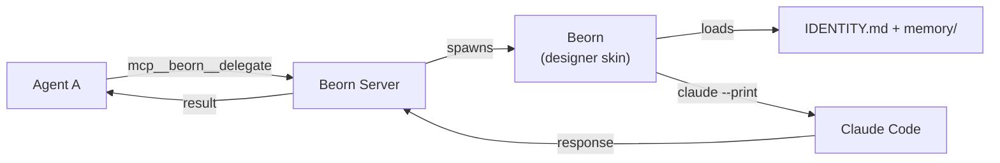

# Beorn

A **beorn** is a short-lived agent clone. It assumes a **skin** — the target agent's identity and memory — handles a single request, and exits. The **beorn server** is the MCP factory that spawns beorns on demand.

## Why

Current agent runtimes don't allow subagents to spawn other subagents. A deployer agent can't ask a designer agent for a review — only root can spawn agents. The beorn server removes this limitation. Any agent, at any depth, can spawn a beorn with another agent's skin.



## Tools

| Tool | Input | Description |
|------|-------|-------------|
| `mcp__beorn__delegate` | `{ agent, prompt }` | Spawn a beorn with the target agent's skin |
| `mcp__beorn__status` | `{}` | Server uptime, known agents, active requests |

??? example "Deployer consulting designer"

    ```
    mcp__beorn__delegate({
      agent: "designer",
      prompt: "Should we use Recreate or RollingUpdate strategy?"
    })
    ```

    The beorn server spawns a beorn with the designer skin — loads IDENTITY.md and memory, runs `claude --print`, and returns the response.

## How It Works

1. **Request arrives** — an agent calls `mcp__beorn__delegate` with a target agent name and prompt
2. **Identity loading** — reads the target's `IDENTITY.md` (stripped of frontmatter) and memory files from `$KORDINATE_HOME/agents/<name>/`
3. **Beorn spawned** — a new `claude --print` process runs with the skin as its system prompt
4. **Response** — the beorn server returns the response to the caller

Each beorn is independent. Concurrent requests spawn separate beorns — each with its own Claude process.

## Architecture

The beorn server runs as a Node.js Express server with the MCP SDK (`@modelcontextprotocol/sdk`). Stateless HTTP MCP endpoint at `/mcp` and health endpoint at `/health`.

```
lib/mcp-agent-server/
├── server.js        # Express + MCP server, tool handlers
├── package.json     # express, @modelcontextprotocol/sdk, zod
└── .gitignore
```

**Local:** `/install` installs deps, registers the MCP server, and starts the beorn server automatically.

**K8s:** Beorn runs as a background process inside the workstation pod (master namespace) on port 3100. The workstation entrypoint starts `node server.js &` at boot. Accessed at `http://localhost:3100/mcp` from within the pod. No separate deployment or image needed.
