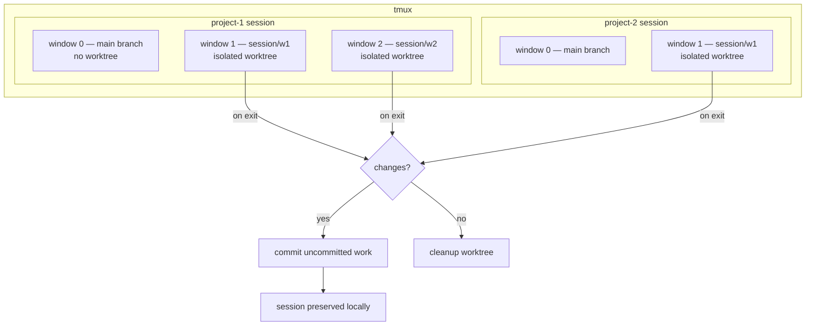

# Sessions & Branches

Each tmux window runs its own agent runtime with isolated agents and hooks. Windows create isolated git worktrees + branches via `bin/claude-session`. On exit: commits uncommitted work, cleans up if no changes.

## Branch Model

Session branches are **local only** -- never pushed to remote. The agent pushes directly to main when ready (`git push origin HEAD:main`). If that fails (non-fast-forward), use `/merge` to rebase.

`main` → `test` → `prod`
