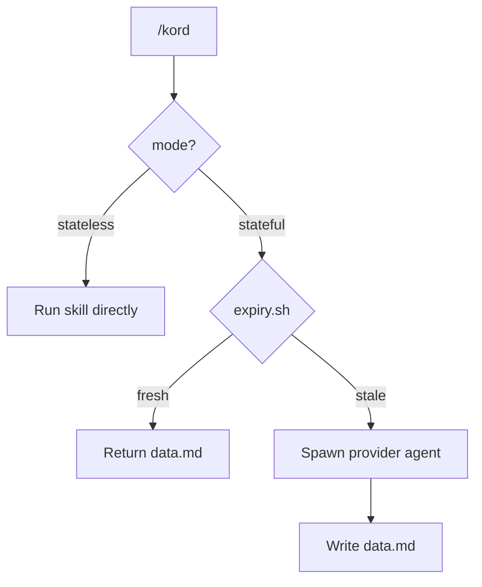

# Kords

A **kord** is a contract between two agents. See [Overview](overview.md#problem) for why kords exist.

## Modes

Each kord specifies how the provider fulfills the request:

- **`stateless`** — skill instructions are self-contained. Runs without the provider agent's memory or context. The requester executes the skill directly. Fast.
- **`stateful`** — skill works better with the provider agent's accumulated memory and context. Spawns the full agent (via Beorn or native subagent).

??? example "stateless — remember"

    ```markdown
    ---
    description: Write a memory for an agent
    requester: any
    provider: scribe
    mode: stateless
    skill: remember
    ---
    ```

    The requester invokes `/remember` directly — no scribe agent spawned.

??? example "stateful — deployer-default"

    ```markdown
    ---
    description: General deployment and cluster questions
    requester: any
    provider: deployer
    mode: stateful
    ---

    ## Provider Guidelines

    Answer with specific names, endpoints, and configuration paths.
    Keep under 50 lines.

    ### Response Format

    | Field | Required |
    |-------|----------|
    | Infrastructure topology (services, namespaces, dependencies) | yes |
    | Monitoring pipeline (collection → storage → visualization) | yes |
    | Configuration sources (files, ConfigMaps) | if applicable |

    ## Provider State Invalidation

    Invalidate when:
    - Cluster manifests are modified
    - Services are redeployed
    - Monitoring stack configuration changes
    ```

### Cache Freshness

Stateful kords cache results. Each kord can have an `expiry.sh` script that checks if the cache is still valid.



### Creating Kords

Describe what you need. Scribe creates the contract:

```
/create-kord pattern-review "architecture review for deployment changes"
```

### Structure

Kords live at `$KORDINATE_HOME/kords/`:

```
$KORDINATE_HOME/kords/
├── pattern-review/
│   ├── contract.md         # protocol definition
│   ├── data.md             # cached result (stateful mode)
│   └── expiry.sh           # freshness check (optional)
├── scribe-remember/
│   └── contract.md         # stateless mode — no data.md needed
└── deployer-default/
    ├── contract.md
    ├── data.md
    └── expiry.sh
```

??? note "Contract template"

    ```markdown
    ---
    description: <what this kord provides>
    requester: <agent or "any">
    provider: <agent>
    mode: <stateless or stateful>
    skill: <skill-name>          # required if mode is stateless
    ---

    ## Provider Guidelines

    <Instructions for how the provider should respond.>

    ### Response Format

    | Field | Required |
    |-------|----------|
    | <field> | yes/no |

    ## Provider State Invalidation

    Invalidate when:
    - <condition>
    ```
