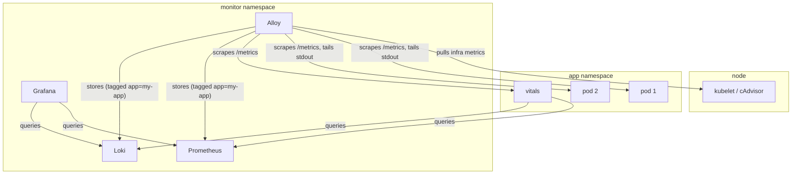

# Monitoring

Observability architecture for apps deployed to the cluster.

## The `app` Label

Every pod must have the Kubernetes label `app: <name>`. This is the universal key — Alloy copies it to every metric and log it collects, making all data queryable by application across Prometheus, Loki, and Grafana.

## Architecture

Two layers: Alloy collects per-pod data, Vitals evaluates per-app health.

| Layer | Scope | Collector | Namespace | What |
|-------|-------|-----------|-----------|------|
| **Pod** | per-pod | Alloy | monitor | Infra metrics, app metrics, logs |
| **App** | per-app | Vitals | app namespace | Health evaluation, derived metrics |



## Alloy: Pod-Level Collection

Alloy runs in the monitor namespace and collects three concerns per pod:

| Concern | Source | How |
|---------|--------|-----|
| Infra metrics | kubelet, cAdvisor | CPU, memory, network, disk — automatic for all pods |
| App metrics | pod `/metrics` | Scraped if pod has `prometheus.io/scrape` annotation |
| Logs | pod stdout | Tailed via K8s API, written to Loki |

Alloy uses relabeling to copy the Kubernetes `app` pod label onto everything it collects. Infra metrics are always available — no app instrumentation needed. App metrics are opt-in.

### Pod Annotations

For pods that expose `/metrics`:

```yaml
metadata:
  labels:
    app: my-app
  annotations:
    prometheus.io/scrape: "true"
    prometheus.io/port: "<port>"
```

Pods without `/metrics` still get infra metrics and log collection — only the `app` label is required.

### Logs

Apps write structured JSON to stdout. No special libraries required. Alloy tails pod stdout via the K8s API and writes to Loki. Log delivery is **best-effort** — apps must not block on stdout.

| Field | Required | Purpose |
|-------|----------|---------|
| `level` | yes | Log level (info, warning, error) |
| `event` | yes | What happened |
| *additional fields* | no | App-defined, become Loki labels automatically |

### Metrics

Apps that have per-pod business metrics expose `/metrics` in Prometheus format. Examples: request latency histograms, messages processed counters, queue depth gauges. Alloy discovers scrape targets via pod annotations and adds the `app` label during scrape.

## Vitals: App-Level Evaluation

Each app deploys **one vitals pod in its own namespace** that evaluates health by querying Prometheus and Loki. Vitals is standalone (not a sidecar) because it needs a cross-pod view — aggregating across consumer groups, volumes, and processes.

Vitals produces two types of metrics:

1. **Health gauges** — tri-state (`0=FAIL, 1=WARNING, 2=OK`) evaluations of app concerns
2. **Derived metrics** — app-level aggregations that don't exist at the pod level

### Health Gauges

| Metric | What it answers | Example |
|--------|----------------|---------|
| `vitals_process{process}` | Is this process alive? | `vitals_process{process="consumer"}` |
| `vitals_<section>{check}` | Is this concern healthy? | `vitals_deps{check="postgres_primary"}` |

Recommended sections — extend with app-specific sections as needed:

| Section | What it covers |
|---------|---------------|
| `vitals_deps` | External dependencies (databases, APIs, caches) |
| `vitals_ingestion` | Data intake pipelines (Kafka lag, consumption rates) |
| `vitals_storage` | Persistence layer (PVC usage, DB file sizes) |
| `vitals_serving` | Request handling, API readiness |
| `vitals_queue` | Message queue consumers/producers |

### Derived Metrics

App-level aggregations that vitals computes from pod-level data:

| Example metric | What it computes |
|----------------|-----------------|
| `vitals_pipeline_latency_seconds` | End-to-end time from ingestion to output across pods |
| `vitals_consumer_lag_total` | Sum of Kafka consumer lag across all consumer groups |
| `vitals_throughput_messages_per_second` | Aggregate message rate across all consumer pods |

Check labels should be short, specific, snake_case.

### Deployment

One vitals deployment per app, per namespace:

```yaml
apiVersion: apps/v1
kind: Deployment
metadata:
  name: vitals
  labels:
    app: my-app
    component: vitals
spec:
  replicas: 1
  template:
    metadata:
      labels:
        app: my-app
        component: vitals
      annotations:
        prometheus.io/scrape: "true"
        prometheus.io/port: "9131"
    spec:
      containers:
        - name: vitals
          args: ["-m", "monitor.vitals", "--port", "9131"]
          env:
            - name: PROMETHEUS_URL
              value: "http://prometheus.monitor.svc.cluster.local:9090"
            - name: LOKI_URL
              value: "http://loki.monitor.svc.cluster.local:3100"
          ports:
            - containerPort: 9131
              name: metrics
```

## Dashboards

Grafana runs in the monitor namespace and queries Prometheus and Loki. Dashboards are stored as JSON and provisioned via ConfigMaps:

```bash
kubectl create configmap grafana-dashboards -n monitor \
  --from-file=dashboards/ --dry-run=client -o yaml | kubectl apply --server-side -f -
```

Grafana polls for changes every 30 seconds. Each app should have at least one dashboard showing its vitals health gauges and key business metrics.

## Alerting

### Meta-alerts

Detect silent vitals failures — if vitals itself goes down, you lose health visibility:

```yaml
- alert: VitalsMissing
  expr: absent(vitals_process{app="my-app"})
  for: 5m
  labels:
    severity: warning
```

### App alerts

Alert rules are defined per-app based on vitals gauges:

```yaml
- alert: DependencyDown
  expr: vitals_deps{app="my-app"} == 0
  for: 2m
  labels:
    severity: critical

- alert: IngestionDegraded
  expr: vitals_ingestion{app="my-app"} == 1
  for: 10m
  labels:
    severity: warning
```

## Onboarding a New App

1. Add the `app` label to all pods
2. Optionally expose `/metrics` with `prometheus.io/scrape` annotation
3. Deploy a vitals pod that evaluates health and derived metrics
4. Add a Grafana dashboard
5. Add alert rules for critical vitals gauges

Vitals is not required for short-lived jobs or CronJobs — use exit codes and `kube_job_status_*` metrics instead. Platform infrastructure (Alloy, Prometheus, Loki) has its own health mechanisms and does not use vitals.

## Related

- [Service Manager](../reference/patterns/service-manager.md) — managed processes should comply with this contract
