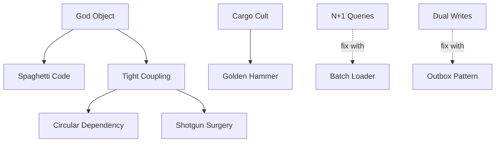

# Anti-Patterns

What to avoid. Each entry describes what the problem looks like and what to do instead. Organized by category -- if you recognize a pattern here in your codebase, that is a signal to refactor.

## How Anti-Patterns Relate

Anti-patterns feed each other. Fixing one often reveals or prevents others.

Solid arrows show causal chains: a God Object tends to produce spaghetti code and tight coupling, which leads to circular dependencies and shotgun surgery. Dotted arrows show known fixes.

---

## Code Structure

Problems with how code is organized at the file and class level.

| Anti-pattern | What it looks like | What to do instead |
|-------------|-------------------|-------------------|
| God Object | A class with 1000+ lines touching many unrelated concerns | Split into focused classes with single responsibilities |
| Spaghetti Code | Deeply nested conditionals, 500+ line functions, untraceable control flow | Extract methods, flatten with early returns, apply guard clauses |
| Lava Flow | Dead code, commented-out blocks, unreachable branches | Delete dead code -- version control remembers it if you need it back |
| Golden Hammer | One tool or framework forced onto every problem | Choose tools based on the problem, not familiarity |
| Cargo Cult | Patterns applied without understanding (factory for one type, DI for no reason) | Understand the problem before applying the solution |
| Big Ball of Mud | No module boundaries, any file imports any other | Introduce module boundaries with explicit public interfaces |
| Copy-Paste Programming | Identical or near-identical code in multiple places | Extract shared logic into functions or modules |
| Reinventing the Wheel | Custom implementations of well-solved problems (crypto, parsers, ORMs) | Use established libraries; write custom code only when requirements genuinely differ |

---

## Naming

Problems with how things are named.

| Anti-pattern | What it looks like | What to do instead |
|-------------|-------------------|-------------------|
| Misleading Names | `get*` that mutates, `is*` returning non-boolean, `validate()` that saves | Name functions for what they actually do |
| Inconsistent Naming | Mixed camelCase/snake_case, same concept with different names across files | Pick a convention and enforce it with a linter |

---

## Dependencies

Problems with how modules depend on each other.

| Anti-pattern | What it looks like | What to do instead |
|-------------|-------------------|-------------------|
| Circular Dependency | A imports B imports A (direct or transitive) | Break the cycle with an interface, event, or shared abstraction |
| Tight Coupling | Concrete class references everywhere, no interfaces | Program to interfaces; inject dependencies |
| Leaky Abstraction | Implementation details visible in interface signatures (SQL in a repository interface) | Redesign the interface to express domain concepts, not infrastructure |

---

## Coupling

Problems with how components interact.

| Anti-pattern | What it looks like | What to do instead |
|-------------|-------------------|-------------------|
| Temporal Coupling | Methods must be called in a specific order but nothing enforces it | Use a builder, state machine, or method that encapsulates the sequence |
| Hidden Side Effects | Functions that look pure but modify global state, write files, or send HTTP | Make side effects explicit in function signatures and names |
| Train Wreck | `a.getB().getC().getD().doThing()`, violating the Law of Demeter | Ask the immediate object to do the work; do not reach through it |

---

## Data

Problems with data access and modeling.

| Anti-pattern | What it looks like | What to do instead |
|-------------|-------------------|-------------------|
| N+1 Queries | Database query inside a loop, ORM lazy loading during iteration | Batch load with `WHERE id IN (...)` or use a DataLoader |
| Premature Optimization | Caching before measuring, complex data structures for small datasets | Profile first; optimize the measured bottleneck |
| Stringly Typed | Strings where enums or types should be, string comparison for branching | Use enums, union types, or value objects |
| Magic Numbers | Hardcoded numeric values with no explanation | Extract to named constants with clear meaning |
| Dual Writes | Writing to two systems (DB + cache, DB + search index) without transactional guarantee | Use the Outbox pattern or Change Data Capture |
| Schema-on-Read | No enforced schema, parsing and validation scattered throughout consumers | Define schemas explicitly; validate at ingestion |

---

## Complexity

Problems with cognitive load and readability.

| Anti-pattern | What it looks like | What to do instead |
|-------------|-------------------|-------------------|
| Primitive Obsession | Email, phone, money represented as plain strings or numbers | Create value objects with validation and behavior |
| Boolean Blindness | 3+ boolean params: `create(true, false, true)` | Use named parameters, enums, or option objects |
| Deep Nesting | 5+ levels of if/for/try nesting, arrow-shaped code | Flatten with early returns, extract methods, invert conditions |

---

## Concurrency

Problems with parallel and asynchronous code.

| Anti-pattern | What it looks like | What to do instead |
|-------------|-------------------|-------------------|
| Race Condition | Unsynchronized read-modify-write on shared state | Use atomic operations, locks, or message passing |
| Deadlock | Multiple locks acquired in inconsistent order | Always acquire locks in a consistent global order; use timeouts |
| Callback Hell | Deeply nested callbacks forming a pyramid | Use async/await, promises, or reactive streams |
| Sync-in-Async | Blocking call inside an async function, starving the event loop | Use async-native libraries; offload blocking work to a thread pool |
| Busy Waiting | Spinning in a loop checking a condition | Use condition variables, channels, or event-based notification |

---

## Error Handling

Problems with how failures are caught and propagated.

| Anti-pattern | What it looks like | What to do instead |
|-------------|-------------------|-------------------|
| Pokemon Exception | `except:` or `catch(Exception)` catching everything | Catch specific exception types; let unexpected ones propagate |
| Error Code Returns | Functions returning -1/0/null for errors in languages with exceptions | Use exceptions or Result types; error codes get ignored |
| Log and Throw | Same exception logged at every layer it passes through | Log at the handling boundary only; propagate without logging |
| Swallowed Exception | Empty catch/except blocks, errors silently ignored | Handle the error or let it propagate; never silently swallow |

---

## API / Interface

Problems with how services expose their capabilities.

| Anti-pattern | What it looks like | What to do instead |
|-------------|-------------------|-------------------|
| Chatty API | 10+ sequential calls to assemble one view, no batch endpoints | Add aggregate endpoints or use GraphQL for flexible queries |
| Anemic Domain Model | Model classes with only getters/setters, all logic in service classes | Move behavior into domain objects where it belongs |
| God Endpoint | Single route handling multiple operations via an action parameter | Split into distinct endpoints with clear HTTP semantics |
| Breaking Changes | Removed fields, changed types, no deprecation or versioning | Version your API; deprecate before removing; never change field types |
| Over/Under-Fetching | Full rows returned when the caller needs one field; N+1 API calls for one view | Use field selection (sparse fieldsets) or purpose-built endpoints |

---

## Architecture

Problems with system-level structure.

| Anti-pattern | What it looks like | What to do instead |
|-------------|-------------------|-------------------|
| Distributed Monolith | Microservices that must be deployed together, share a database, or break when one is down | If services cannot deploy independently, consolidate or fix the coupling |
| Shotgun Surgery | One change requires edits in 5+ files across services | Consolidate related logic; redraw service boundaries |
| Feature Envy | A class that uses another class's data more than its own | Move the method to the class whose data it uses |

---

## Testing

Problems with how code is verified.

| Anti-pattern | What it looks like | What to do instead |
|-------------|-------------------|-------------------|
| Ice Cream Cone | More E2E tests than unit tests, slow and brittle test suite | Invert the pyramid: many unit tests, fewer integration, fewest E2E |
| Flaky Tests | Tests that pass or fail randomly (timing, order-dependent, shared state) | Isolate tests, use deterministic data, remove time dependencies |
| Test Pollution | Tests that modify shared state and affect other tests | Reset state between tests; use fresh fixtures |

---

## Security

Problems with how access and data are protected.

| Anti-pattern | What it looks like | What to do instead |
|-------------|-------------------|-------------------|
| Hardcoded Credentials | Passwords, API keys, or tokens in source code | Use a secret manager (Vault, `pass`, KMS); inject at runtime |
| SQL Injection | User input concatenated into SQL strings | Use parameterized queries or an ORM; never interpolate user input |
| Insecure Deserialization | Deserializing untrusted data without validation (pickle, Java serialization) | Validate and whitelist types; use safe formats (JSON with schema) |

---

## Performance

Problems with resource usage and responsiveness.

| Anti-pattern | What it looks like | What to do instead |
|-------------|-------------------|-------------------|
| Unbounded Growth | Collections, caches, or queues that grow without limit | Set maximum sizes with eviction policies (LRU, TTL) |
| Memory Leak | Objects retained after they are no longer needed, growing heap over time | Use weak references, close resources, profile with heap dumps |

---

## Observability

Problems with monitoring and debugging.

| Anti-pattern | What it looks like | What to do instead |
|-------------|-------------------|-------------------|
| Log Spam | Logging at INFO/DEBUG inside hot loops, gigabytes of unhelpful logs | Log meaningful events at appropriate levels; sample high-frequency events |
| Metric Cardinality Explosion | Labels with unbounded values (user IDs, request paths with IDs) | Use bounded label values; move high-cardinality data to traces |
| Missing Log Context | Log entries with no request ID, user ID, or service name | Use structured logging with correlation IDs and context fields |

---

## Database

Problems with database usage patterns.

| Anti-pattern | What it looks like | What to do instead |
|-------------|-------------------|-------------------|
| SELECT * | Fetching all columns when only a few are needed | Select specific columns; reduces I/O and improves index usage |
| Long Transactions | Transactions held open during external calls or user interaction | Keep transactions short; do external work outside the transaction |

---

## Infrastructure

Problems with environment and deployment practices.

| Anti-pattern | What it looks like | What to do instead |
|-------------|-------------------|-------------------|
| Snowflake Server | Hand-configured servers with no IaC, SSH in deploy scripts | Use Infrastructure as Code; servers should be reproducible |
| Environment Parity Gap | SQLite in dev, Postgres in prod; behavior differs by environment | Match environments as closely as possible; use containers |
| Hardcoded URLs | Service URLs embedded in code instead of configuration | Use config, service discovery, or environment variables |

---

## Configuration

Problems with how settings are managed.

| Anti-pattern | What it looks like | What to do instead |
|-------------|-------------------|-------------------|
| Config Sprawl | Config in env vars AND yaml AND code AND database, no single source of truth | Consolidate into one config system with layered overrides |

---

## Frontend

Problems specific to UI code.

| Anti-pattern | What it looks like | What to do instead |
|-------------|-------------------|-------------------|
| Prop Drilling | Passing props through 5+ component layers to reach a deeply nested child | Use context, state management, or component composition |

---

## Messaging

Problems with message-based communication.

| Anti-pattern | What it looks like | What to do instead |
|-------------|-------------------|-------------------|
| Fire and Forget | Sending messages with no delivery confirmation or retry | Use acknowledgments, dead-letter queues, and idempotent consumers |

---

## Summary

61 anti-patterns across 16 categories. The most damaging ones compound: a God Object leads to tight coupling, which leads to shotgun surgery, which leads to fear of change. Break the chain early by keeping classes focused, dependencies explicit, and boundaries clean.
