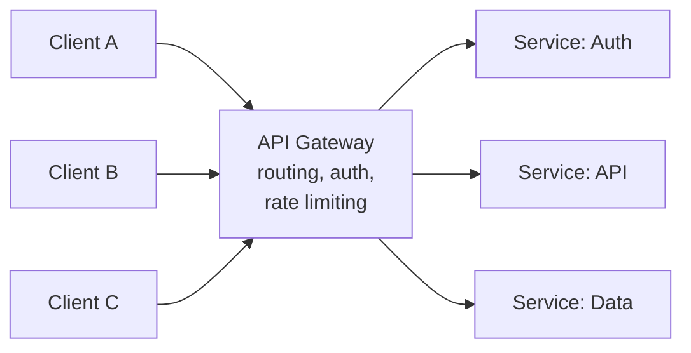

# API Gateway

A single entry point that routes client requests to backend services while handling cross-cutting concerns like auth and rate limiting.

## When to Use

- Multiple backend services need a unified external API surface
- You want to centralize authentication, rate limiting, and request routing
- Clients should not need to know about internal service topology

## How It Works

All client traffic enters through the gateway. The gateway handles cross-cutting concerns (authentication, rate limiting, request transformation) and routes each request to the appropriate backend service. It is a thin policy and routing layer — it contains no business logic.

## Trade-offs

!!! success "Strengths"
    - Clients see a single, stable API regardless of backend service changes
    - Cross-cutting concerns are handled in one place instead of duplicated per service
    - Backend services can evolve independently behind the gateway

!!! warning "Watch out for"
    - Business logic creeping into the gateway — it becomes a monolith bottleneck
    - Single point of failure if not deployed with redundancy and health checks
    - Tight coupling between gateway routing rules and backend implementation details
    - Missing timeouts and circuit breakers for upstream backends
