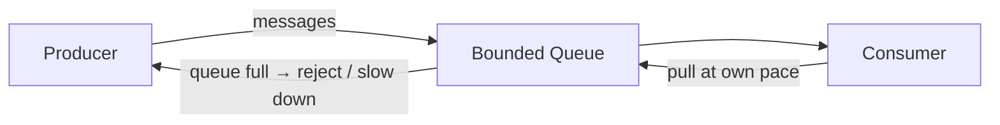

# Backpressure

A flow-control mechanism that signals a fast producer to slow down when the consumer cannot keep up.

## When to Use

- A producer generates data faster than the consumer can process it
- Unbounded queuing would lead to memory exhaustion or cascading latency
- You need explicit load shedding or rate limiting between pipeline stages

## How It Works

The producer sends messages into a bounded queue. When the queue is full, the system signals back — either rejecting new messages, blocking the producer, or applying rate limiting. This prevents runaway memory growth and keeps the pipeline stable under load.

## Trade-offs

!!! success "Strengths"
    - Prevents out-of-memory crashes from unbounded buffering
    - Makes producer-consumer imbalance visible and controllable
    - Works at every layer: in-process, message queues, HTTP (429 status), TCP flow control

!!! warning "Watch out for"
    - Dropping messages silently — always log or meter shed load
    - Backpressure that propagates all the way to the user without a clear error
    - Consumer lag growing monotonically — indicates the consumer needs scaling, not just backpressure
