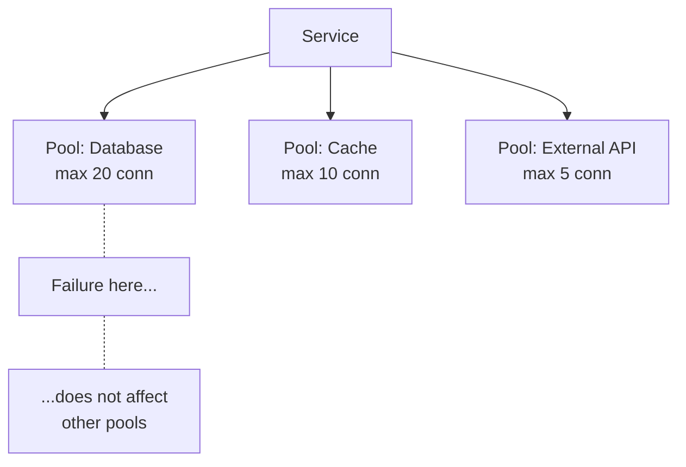

# Bulkhead

Isolates resources into separate pools so one failing dependency cannot exhaust the whole system.

## When to Use

- Your service talks to multiple external dependencies (databases, caches, APIs)
- A slow or failing dependency could starve other healthy dependencies of connections or threads
- You need failure isolation — one bad dependency should not take down unrelated features

## How It Works

Each dependency gets its own bounded resource pool (connections, threads, or semaphores). When one pool is exhausted, requests to that dependency are rejected immediately while the other pools continue working normally.

## Trade-offs

!!! success "Strengths"
    - Prevents a single slow dependency from consuming all resources
    - Failures are contained — unrelated features keep working
    - Pool exhaustion triggers fast failure instead of unbounded queuing

!!! warning "Watch out for"
    - A single shared pool across all dependencies defeats the purpose
    - Pool sizes need tuning per dependency based on expected load
    - No monitoring on pools means exhaustion goes unnoticed until outage
