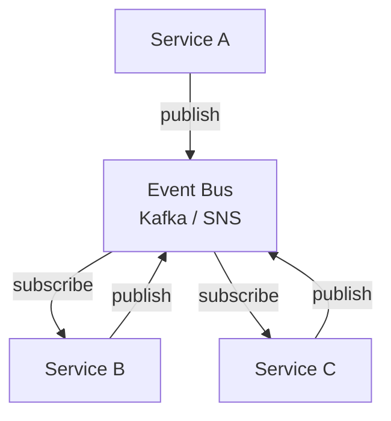

# Choreography

Coordinates distributed workflows through events on a shared bus — each service reacts independently with no central orchestrator.

## When to Use

- Services need loose coupling and should be deployable independently
- The workflow is simple enough that each service can decide what to do based on events it receives
- You want to avoid a central coordinator that becomes a single point of failure

## How It Works

Each service publishes events when something notable happens and subscribes to events it cares about. There is no central coordinator — the workflow emerges from each service reacting to events and publishing new ones. Every event carries a correlation ID so the full flow can be traced end-to-end.

## Trade-offs

!!! success "Strengths"
    - Services are decoupled — each can be deployed and scaled independently
    - No single point of failure coordinating the workflow
    - Adding a new participant means subscribing to existing events, not modifying a central orchestrator

!!! warning "Watch out for"
    - Implicit ordering assumptions (Service B assumes A always fires first)
    - Event ping-pong — two services triggering each other in an infinite loop
    - Difficult to trace what happened without correlation IDs and good observability
    - Choreography becomes unwieldy for complex multi-step flows — consider a saga instead
