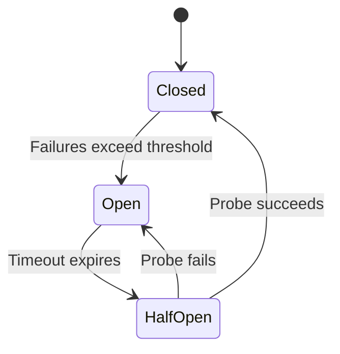

# Circuit Breaker

Automatically stops calling a failing dependency, giving it time to recover.

## When to Use

- An external service or database is unreliable and may go down periodically
- You want to fail fast instead of waiting for timeouts on every request
- Cascading failures could spread from one degraded dependency to the whole system

## How It Works

The breaker starts **Closed** (normal traffic). When failures cross a threshold, it flips to **Open** and rejects all calls immediately. After a cooldown, it enters **Half-Open** and sends a single probe request. If that succeeds, it closes again; if not, it re-opens.

## Trade-offs

!!! success "Strengths"
    - Prevents wasting resources on calls that will likely fail
    - Gives the downstream service breathing room to recover
    - Makes failure visible and controllable via state transitions

!!! warning "Watch out for"
    - Wrapping every call in a breaker — only external dependencies need them
    - No fallback defined — callers get raw exceptions when the circuit opens
    - Shared circuit state across unrelated dependencies (one drags down another)
    - Hardcoded thresholds — make failure count and recovery timeout configurable
