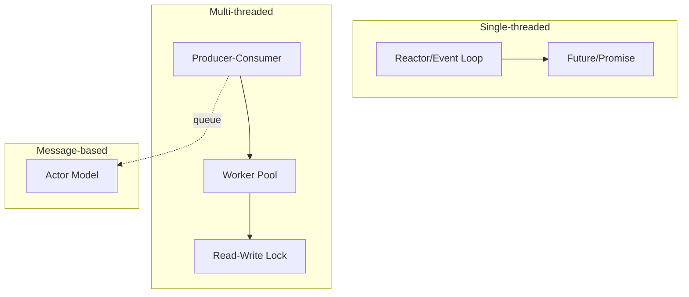

# Concurrency Patterns

How parallel work is managed.

Concurrency is not one problem -- it is a family of problems that depend on the nature of the work, the isolation requirements, and the runtime model. The patterns here fall into three families: single-threaded event-driven, multi-threaded shared-state, and message-passing.

## Pattern Families

Single-threaded patterns avoid locks entirely by processing one event at a time. Multi-threaded patterns share memory and use explicit synchronization. Message-based patterns isolate state behind mailboxes and communicate only through messages. The dotted line shows that Producer-Consumer queues are the bridge between the multi-threaded and message-based worlds.

---

## Reactor / Event Loop

Multiplexes many I/O-bound tasks onto a single thread using non-blocking operations and callbacks.

Use a Reactor when your workload is heavily I/O-bound -- HTTP servers, database proxies, chat systems. Because there is only one thread, there are no locks and no data races. The tradeoff is that any CPU-heavy computation blocks the entire loop, so you must offload expensive work to a thread pool or a separate process. Node.js, nginx, and Redis all use this model.

## Future / Promise

Represents a value that will be available later, allowing you to compose asynchronous operations without deeply nested callbacks.

Use Futures when you are working inside a Reactor or event loop and need to chain multiple async steps -- fetch a record, then transform it, then write it back. Futures turn that sequence into a flat pipeline with explicit error handling at each stage. They are the ergonomic layer on top of the event loop, not a concurrency model on their own. Most modern runtimes (async/await in Python, Rust, JavaScript) compile down to this.

## Worker Pool

Maintains a fixed set of threads that pull tasks from a shared queue.

Use a Worker Pool for CPU-bound parallel work -- image processing, encryption, batch computations. The pool bounds the number of active threads so you do not over-subscribe the CPU or exhaust OS resources. Tasks are submitted to a queue and executed by the next available worker. The pool size should match the number of available cores for CPU-bound work, or be larger for mixed I/O-and-CPU workloads.

## Read-Write Lock

Allows many concurrent readers but only one writer, with writers blocking until all readers finish.

Use a Read-Write Lock when shared state is read far more often than it is written -- configuration caches, routing tables, in-memory indexes. The lock lets readers proceed in parallel, which is a significant throughput improvement over a plain mutex when writes are rare. Be aware of writer starvation: if readers arrive continuously, a waiting writer may never get its turn. Most implementations offer a "writer-preferring" mode to prevent this.

## Producer-Consumer

Decouples the generation of work from its processing through a shared queue.

Use Producer-Consumer when the rate of incoming work varies and you want to smooth out bursts. The producer pushes items into a bounded queue; one or more consumers pull from it at their own pace. This pattern naturally accommodates backpressure -- when the queue is full, the producer blocks or drops. It is the foundation of most pipeline architectures, message brokers, and batch processing systems.

## Actor Model

Encapsulates state inside independent actors that communicate only through asynchronous messages.

Use the Actor Model when you need strong isolation between concurrent components -- each actor owns its state, processes one message at a time, and never shares memory. This eliminates data races by design. Actors can create child actors, forming supervision trees where a parent decides how to handle a child's failure (restart, escalate, stop). Erlang/OTP and Akka are the canonical implementations.

---

## Decision Guide

Choosing the right concurrency model depends on the nature of the work and the isolation you need.

**I/O-bound, high connection count, single machine:**
Use a **Reactor / Event Loop**. One thread handles thousands of connections without context-switch overhead. Compose async steps with **Futures/Promises**. Offload any CPU-heavy work to a thread pool.

**CPU-bound parallel computation:**
Use a **Worker Pool**. Size the pool to the number of available cores. Feed it through a **Producer-Consumer** queue so that bursts are absorbed rather than rejected. Protect shared read-heavy state with a **Read-Write Lock**.

**Isolated components that must not share state:**
Use the **Actor Model**. Each component gets its own actor with a private mailbox. No locks, no shared memory. Supervision trees handle failure recovery. This is the right choice when correctness matters more than raw throughput.

**Mixed workloads:**
Combine the models. A common architecture uses a Reactor for network I/O, a Worker Pool for CPU tasks, and Actors for stateful domain logic -- connected by Producer-Consumer queues.
