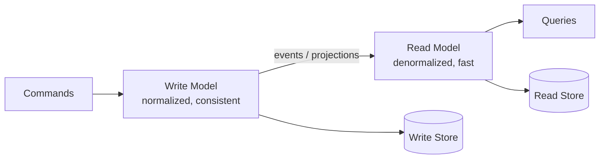

# CQRS

Separates the write model (commands) from the read model (queries), allowing each to be optimized independently.

## When to Use

- Read and write workloads have very different performance characteristics or scaling needs
- Your read model needs denormalized views that do not fit the write schema
- You are already using event sourcing and need efficient query projections

## How It Works

Commands mutate the write model, which is optimized for consistency and validation. Changes flow to the read model through an explicit sync mechanism (events, projections, or change-data-capture). Queries read exclusively from the read model, which is denormalized for fast lookups. The two models can use different databases and scale independently.

## Trade-offs

!!! success "Strengths"
    - Read and write sides scale independently
    - Read model can be shaped exactly for query needs (no compromises)
    - Read model is rebuildable from scratch by replaying the sync mechanism

!!! warning "Watch out for"
    - Eventual consistency between write and read models — callers must tolerate stale reads
    - No clear sync mechanism causes the read model to silently drift
    - Unnecessary complexity if a single model handles both reads and writes fine
    - Read path must never sneak writes back into the write model
