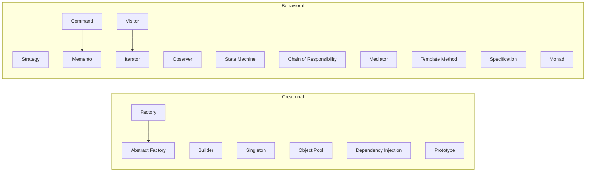

# Creational & Behavioral Patterns

Classic patterns for object creation and inter-object communication. These are the building blocks that show up inside services, regardless of architecture style.

## Overview

---

## When to Use What

### Creating Objects

Use these when you need to separate *what gets created* from *how it gets created*.

**Factory** -- A method or class that returns an object, hiding the concrete type behind an interface. Use when the caller should not know or care about which implementation it gets. A `createLogger("file")` that returns a `FileLogger` or `ConsoleLogger` depending on config.

**Abstract Factory** -- A factory of factories. Returns a family of related objects that belong together. Use when you need to create sets of objects that must be compatible (e.g., a UI toolkit factory that produces matching buttons, dialogs, and text fields for a specific platform).

**Builder** -- Step-by-step construction with a fluent interface. Use when objects have many optional parameters, when construction has multiple valid orderings, or when you want to prevent partially-constructed objects. `QueryBuilder().select("name").from("users").where("active").build()`.

**Prototype** -- Create new objects by cloning an existing one. Use when construction is expensive and you have a representative instance to copy from. Common in game engines (cloning entity templates) and configuration systems (cloning a default config and overriding fields).

**Object Pool** -- Maintain a set of pre-created objects that are borrowed and returned. Use for expensive-to-create resources: database connections, thread pools, gRPC channels. The pool handles creation, validation, and cleanup. Callers get an object, use it, and return it.

### Managing Dependencies

**Dependency Injection** -- Pass dependencies in from outside (constructor, setter, or framework) instead of creating them internally. Use everywhere. DI is the single most impactful pattern for testability and flexibility. If a class creates its own database connection, you cannot test it without a database. If it accepts a connection interface, you can pass a mock.

**Singleton** -- Exactly one instance, globally accessible. Use sparingly. Legitimate uses: configuration objects, connection pools, logging facades. The pattern itself is simple -- the danger is overuse. If you reach for singleton because "there should only be one," ask whether dependency injection with a single instance achieves the same thing without global state.

### Selecting Algorithms

Use these when you need to choose or swap behavior at runtime.

**Strategy** -- Define a family of algorithms, encapsulate each one, and make them interchangeable. The caller holds a reference to the strategy interface and calls it without knowing which implementation is behind it. Use for payment processing (different gateways), sorting (different algorithms), or validation (different rule sets).

**Template Method** -- Define the skeleton of an algorithm in a base class, deferring specific steps to subclasses. The base class calls abstract methods that subclasses override. Use when you have a fixed process with variable steps -- like an ETL pipeline where extract/transform/load have standard orchestration but per-source implementations.

### Handling Events

Use these when objects need to communicate without tight coupling.

**Observer** -- An object (subject) maintains a list of dependents (observers) and notifies them of state changes. Use for event systems, UI data binding, and reactive programming. The subject does not know the concrete types of its observers. Be careful with memory leaks from forgotten subscriptions.

**Mediator** -- A central object that coordinates communication between components. Instead of A calling B and C directly, A tells the mediator, and the mediator routes to B and C. Use when many-to-many communication between components is becoming tangled. Chat rooms, form validation coordinators, and air traffic control are classic mediator examples.

**Command** -- Encapsulate a request as an object. The command carries all the information needed to execute the action. Use when you need undo/redo (each command has execute and undo), when you need to queue or log operations, or when you want to decouple the invoker from the executor. Pairs naturally with Memento for capturing state before execution.

### Traversal and Matching

**Visitor** -- Separate an algorithm from the object structure it operates on. The structure's elements accept a visitor, and the visitor performs the operation. Use when you have a stable structure (like an AST) but frequently add new operations (pretty-print, type-check, optimize). Adding a new operation means adding a new visitor, not modifying every node class.

**Iterator** -- Provide sequential access to elements without exposing the underlying structure. Use when you need to traverse a collection (list, tree, graph, database cursor) uniformly. Iterators can be lazy, only computing the next element on demand -- essential for large or infinite sequences.

**Specification** -- Composable boolean predicates that encode business rules. Specifications can be combined with `and`, `or`, and `not`. Use when you have complex filtering logic that appears in multiple places -- instead of duplicating conditionals, encode each rule as a specification and compose them. `ActiveUser.and(PremiumTier).and(NotBanned)`.

**Monad / Railway** -- Chain operations where each step can succeed or fail. If a step fails, the rest of the chain is skipped. Implemented as `Result<T, E>`, `Either`, or `Option` types with `map` and `flatMap`. Use to eliminate nested error checking and make the happy path readable. The "railway" metaphor: success stays on the main track, failure switches to the error track.

---

## Other Behavioral Patterns

**State Machine** -- An object whose behavior changes based on its current state. Transitions are explicit and guarded. Use for order processing (pending, confirmed, shipped, delivered), connection management (connecting, connected, disconnecting), or any workflow with distinct phases. State machines make invalid transitions impossible by construction.

**Chain of Responsibility** -- A request passes along a chain of handlers. Each handler decides whether to process it or pass it to the next. Use for middleware stacks (auth, logging, rate limiting), event processing, and input validation chains. The chain can be configured at runtime.

**Memento** -- Capture an object's internal state so it can be restored later. Use for undo/redo, checkpointing, and snapshotting. The memento is opaque to everything except the originator -- other code can store it but cannot read or modify its contents.

---

## Pattern Combinations

Some of these patterns almost always appear together:

| Combination | Why |
|-------------|-----|
| Factory + DI | Factory creates; DI provides the factory |
| Command + Memento | Command executes; memento stores pre-execution state for undo |
| Strategy + Factory | Factory selects the right strategy based on context |
| Observer + Mediator | Observers react to events; mediator routes them |
| Visitor + Iterator | Iterator traverses; visitor operates on each element |
| Builder + Prototype | Builder constructs from scratch; prototype clones a template |
