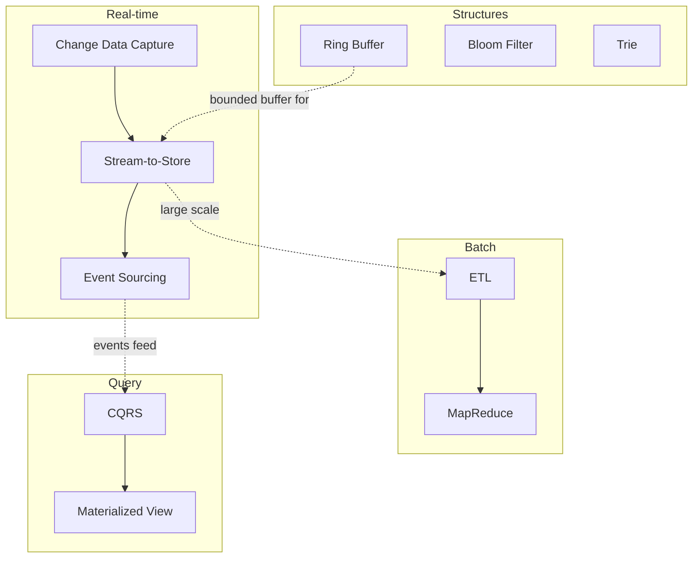

# Data Patterns

How data flows and is stored. Data patterns address the gap between where data originates and where it needs to end up, covering real-time streaming, batch processing, query optimization, and specialized data structures. The right choice depends on latency requirements, data volume, and whether you need the full history or just the current state.

## Pattern Relationships

Real-time patterns form a pipeline: CDC captures changes, stream-to-store lands them, and event sourcing preserves the full history. Event sourcing naturally feeds CQRS read models. Batch processing handles what streaming cannot do efficiently at scale. Specialized structures solve targeted performance problems.

---

## Stream-to-Store

Use when you need to land streaming data into a database, data lake, or object store with batching for efficiency. The consumer reads from a broker, buffers by size or time, and flushes in bulk. Offsets commit only after a successful write, guaranteeing at-least-once delivery.

!!! tip "Common combinations"
    Stream-to-Store + Ring Buffer + Idempotent Consumer. The ring buffer bounds memory during buffering; idempotent consumers handle the duplicates that at-least-once delivery produces.

See also: [Stream-to-Store](stream-to-store.md) for a full breakdown.

---

## ETL / ELT

Use when data needs to move between systems on a schedule -- APIs to warehouses, databases to lakes, legacy to modern. ETL transforms before loading; ELT loads raw and transforms in-place. Both use bookmarks for incremental extraction and idempotent loads for safe retries.

!!! tip "Common combinations"
    ETL + MapReduce + Materialized View. Large-scale transforms use MapReduce; the output often lands in materialized views for fast querying.

See also: [ETL](etl.md) for a full breakdown.

---

## Event Sourcing

Use when you need a complete audit trail, the ability to reconstruct state at any point in time, or when domain events are a natural fit for your business logic. State is derived by replaying an append-only event log rather than reading a mutable row. Snapshots shortcut long replay chains.

!!! tip "Common combinations"
    Event Sourcing + CQRS + Stream-to-Store. Events feed CQRS read projections; stream-to-store lands events into the event store from the broker.

See also: [Event Sourcing](event-sourcing.md) for a full breakdown.

---

## CQRS (Command Query Responsibility Segregation)

Use when read and write workloads have fundamentally different performance needs, or when your read model needs denormalized views that do not fit the write schema. Commands go to a normalized, consistent write model. Queries go to a denormalized, fast read model. The two sync via events, projections, or change-data-capture.

!!! tip "Common combinations"
    CQRS + Event Sourcing + Materialized View. Event sourcing provides the sync mechanism; materialized views optimize the read side.

See also: [CQRS](cqrs.md) for a full breakdown.

---

## MapReduce

Use when you need to process a dataset too large for a single machine by splitting it into parallel chunks. Map applies a function to each chunk independently, producing key-value pairs. Reduce aggregates results by key. The model is intentionally simple -- all complexity is in the map and reduce functions, and the framework handles distribution, fault tolerance, and shuffling.

!!! tip "Common combinations"
    MapReduce + ETL. MapReduce often serves as the transform step in large-scale ETL pipelines.

---

## Idempotent Consumer

Use when a message or event may be delivered more than once and you need to guarantee that processing it twice produces the same result as processing it once. The consumer tracks a deduplication key (message ID, idempotency key) and skips already-processed messages. Essential in any at-least-once delivery system.

!!! tip "Common combinations"
    Idempotent Consumer + Stream-to-Store + Event Sourcing. Any consumer downstream of a broker that guarantees at-least-once needs idempotency.

---

## Change Data Capture (CDC)

Use when you need to react to database changes without polling or modifying application code. CDC reads the database's transaction log (WAL, binlog) and emits change events to a broker. This turns any database into an event source without application-level instrumentation. Common for syncing read replicas, feeding search indexes, or bridging legacy systems to event-driven architectures.

!!! tip "Common combinations"
    CDC + Stream-to-Store + CQRS. CDC captures writes, stream-to-store lands them elsewhere, and CQRS uses them to build read models.

---

## Ring Buffer

Use when you need a fixed-size, lock-free buffer for high-throughput producer-consumer scenarios. The ring buffer overwrites the oldest entry when full, providing bounded memory usage with predictable latency. It avoids allocation and garbage collection pressure that dynamic buffers create. Common in logging, metrics collection, and inter-thread communication.

!!! tip "Common combinations"
    Ring Buffer + Stream-to-Store + Backpressure. The ring buffer bounds memory while streaming, and backpressure signals when the consumer cannot keep up.

---

## Bloom Filter

Use when you need a fast, space-efficient test for set membership and can tolerate false positives but not false negatives. A bloom filter can tell you "definitely not in the set" or "probably in the set." Common for avoiding expensive lookups -- check the bloom filter before querying the database, deduplicating URLs in a web crawler, or filtering events before full processing.

!!! tip "Common combinations"
    Bloom Filter + Idempotent Consumer. A bloom filter provides a fast first-pass deduplication check before falling back to a definitive store lookup.

---

## Trie (Prefix Tree)

Use when you need fast prefix-based lookup, autocomplete, or routing. A trie stores strings character-by-character in a tree structure, sharing common prefixes. Lookup time depends on key length, not the number of stored keys. Common in URL routers, IP routing tables, autocomplete engines, and dictionary implementations.

!!! tip "Common combinations"
    Trie + Composite. Tries are inherently composite structures -- each node can be both a value holder and a parent of further branches.
