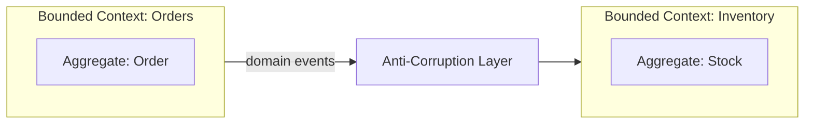

# Domain-Driven Design (DDD)

Organizes software around business domains using bounded contexts, aggregates, and a shared ubiquitous language.

## When to Use

- The business domain is complex and the biggest source of project risk
- Multiple teams work on different parts of the system and need clear boundaries
- You want code structure to mirror how the business actually thinks and talks

## How It Works

Each **bounded context** owns its data and models, using terminology consistent with that part of the business (ubiquitous language). **Aggregates** enforce business invariants within a context. Contexts communicate through domain events or APIs, with an **anti-corruption layer** translating between different models so internal representations never leak across boundaries.

## Trade-offs

!!! success "Strengths"
    - Code boundaries match business boundaries — easier to reason about and evolve
    - Aggregates enforce invariants in one place rather than scattering rules across services
    - Anti-corruption layers prevent one team's model changes from breaking another

!!! warning "Watch out for"
    - Shared database tables across bounded contexts — breaks ownership boundaries
    - Anemic domain models where aggregates are plain data bags with logic elsewhere
    - Importing domain objects directly from another context's internals
    - God aggregates that grow unbounded instead of splitting into sub-contexts
