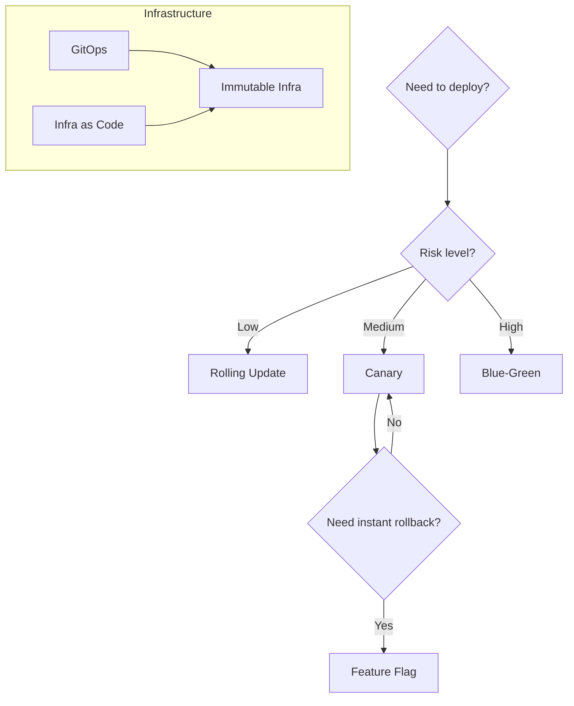

# Deployment Patterns

How software is released.

## Overview

## Decision Guide: Deployment Strategy

| Strategy | How it works | Best for |
|----------|-------------|----------|
| Rolling Update | Replace instances one at a time, shifting traffic gradually | Low-risk changes, stateless services, routine releases |
| Canary | Route a small percentage of traffic to the new version, observe, then promote | Medium-risk changes where you want production validation before full rollout |
| Blue-Green | Run two identical environments; switch all traffic at once | High-risk changes that need instant, complete rollback |
| Feature Flag | Deploy code dark, toggle features on per-user or per-cohort | Decoupling deploy from release, A/B testing, gradual rollouts |

## Release Strategies

### Blue-Green

Two identical production environments exist side by side: blue (current) and green (new). Traffic is routed entirely to one. You deploy the new version to the idle environment, verify it, then switch the router.

**When to use:** You need zero-downtime releases with the ability to roll back instantly by switching the router back.

**Watch out for:** Doubling infrastructure cost while both environments are live. Database migrations must be backward-compatible since both versions may run briefly during the switch. Session state that is pinned to the old environment will be lost.

### Canary

Deploy the new version to a small subset of instances (the canary). Route a fraction of real traffic to it while monitoring error rates, latency, and business metrics. If the canary is healthy, gradually shift more traffic until the rollout is complete.

**When to use:** You want production validation with limited blast radius. Good for changes that are hard to fully test in staging.

**Watch out for:** Canary metrics must be statistically significant before promoting. Small traffic percentages need enough volume to surface problems. Sticky sessions can skew canary results.

### Feature Flag

Code is deployed but new behavior is gated behind a flag. The flag can be toggled at runtime, per-user, per-tenant, or per-cohort, without redeploying.

**When to use:** You want to separate deployment from release. Gradual feature rollouts, A/B testing, kill switches for risky features, trunk-based development with incomplete features.

**Watch out for:** Flag debt. Old flags that are never cleaned up turn the codebase into a maze of conditional branches. Establish a rule: every flag has an owner and a removal date.

## Infrastructure

### GitOps

The desired state of infrastructure and deployments is declared in a Git repository. An operator (Argo CD, Flux) continuously reconciles the live cluster to match what is in Git. All changes go through pull requests.

**When to use:** You want an auditable, reviewable, version-controlled deployment pipeline. Rollback is a `git revert`. Drift detection is built in.

**Watch out for:** Secrets must not be stored in Git (use sealed secrets or external secret operators). The reconciliation loop can fight manual changes, which is by design but confusing if operators are not aware.

### Immutable Infrastructure

Servers and containers are never modified after creation. To update, you build a new image and replace the running instance entirely. No SSH, no patches in place.

**When to use:** You want reproducible, predictable environments. Eliminates configuration drift. Pairs naturally with GitOps and container orchestration.

**Watch out for:** Slower iteration if the image build pipeline is slow. Debugging requires good logging and observability since you cannot SSH in and poke around. Stateful workloads need external storage.
