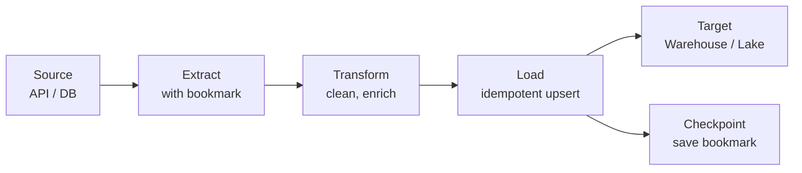

# ETL / ELT

Extracts data from sources, transforms it, and loads it into a target system — or loads raw first and transforms in-place (ELT).

## When to Use

- You need to move data between systems on a schedule (APIs, databases, data warehouses)
- Raw source data needs cleaning, enrichment, or reshaping before it is useful
- You want incremental, resumable data pipelines rather than manual one-off scripts

## How It Works

**Extract** reads data incrementally using a bookmark (timestamp or offset). **Transform** cleans and enriches — this should be pure logic with no side effects. **Load** writes to the target idempotently so reruns do not create duplicates. A checkpoint saves the bookmark for the next run.

In the **ELT** variant, raw data is loaded first and transformation happens inside the target (e.g., dbt models in a warehouse).

## Trade-offs

!!! success "Strengths"
    - Incremental extraction avoids re-reading the entire source every run
    - Idempotent loads make the pipeline safe to retry and replay
    - Pure transform logic is easy to test in isolation

!!! warning "Watch out for"
    - Full re-extract every run when incremental is possible (wastes resources)
    - No checkpoint — failures require restarting from scratch
    - Transform logic embedded in SQL without version control or tests
    - Silent data loss when transform errors drop records without logging
