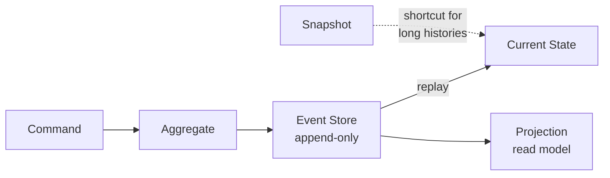

# Event Sourcing

Persists state as an append-only sequence of events rather than overwriting a current-state record.

## When to Use

- You need a complete audit trail of every change that happened
- You want to rebuild state at any point in time by replaying events
- Domain events are a natural fit for your business logic (orders, transactions, workflows)

## How It Works

A command is handled by an aggregate, which emits one or more immutable events. These events are appended to an event store. Current state is reconstructed by replaying events from the store. For aggregates with long histories, snapshots provide a replay shortcut. Projections build read-optimized views from the event stream.

## Trade-offs

!!! success "Strengths"
    - Full history — you can reconstruct state at any point in time
    - Natural audit trail with no extra work
    - Supports temporal queries and what-if replay scenarios

!!! warning "Watch out for"
    - Events must be immutable — never mutate or delete stored events
    - Missing event versioning breaks replay when schemas evolve
    - Long event histories without snapshots make state reconstruction slow
    - Added complexity vs. simple CRUD — only use when the audit/replay benefit justifies it
