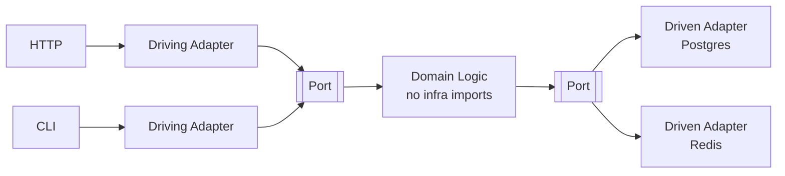

# Hexagonal (Ports & Adapters)

Structures an application so domain logic has zero dependencies on infrastructure — all I/O goes through interfaces.

## When to Use

- You want domain logic that is testable without databases, HTTP, or cloud SDKs
- The application needs to support multiple entry points (HTTP, CLI, message queue)
- You anticipate swapping infrastructure (e.g., Postgres to DynamoDB) without rewriting business logic

## How It Works

**Ports** are interfaces defined by the domain. **Driving adapters** (left side) translate external input into domain calls. **Driven adapters** (right side) implement infrastructure behind port interfaces. The domain layer never imports infrastructure packages — it only knows about its own ports.

## Trade-offs

!!! success "Strengths"
    - Domain logic is fully testable with in-memory adapters — no mocks of concrete classes needed
    - Swapping infrastructure means writing a new adapter, not touching business logic
    - Clear dependency direction: everything points inward toward the domain

!!! warning "Watch out for"
    - Port interfaces that leak infrastructure details (SQL dialects, HTTP headers)
    - Domain code importing `requests`, `boto3`, or DB drivers directly — breaks the architecture
    - Adapter logic bleeding into domain services
    - Over-engineering simple CRUD apps that do not benefit from the indirection
