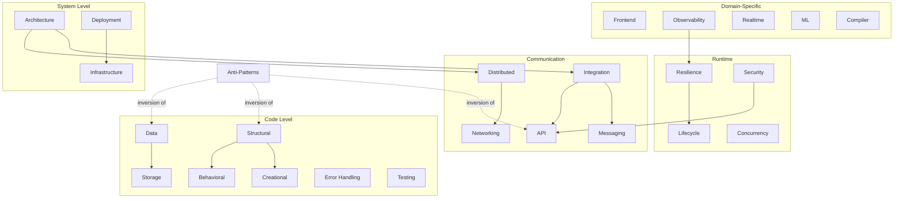

# Pattern Catalog

A reference catalog of 157 design patterns across 20 categories, plus 61 documented anti-patterns. Each pattern describes what it solves, when to use it, and how it works. Anti-patterns describe what to avoid and how to fix it.

## How the Categories Relate

---

## By the Numbers

| | Count |
|-|-------|
| Patterns | 157 |
| Anti-patterns | 61 |
| Categories | 20 |

---

## Category Pages

These pages contain detailed descriptions, mermaid diagrams, and guidance for each pattern group.

| Page | What it covers | Patterns |
|------|---------------|----------|
| [Security](security.md) | How access and trust are managed | OAuth2/OIDC, RBAC, Rate Limiting, Secret Management, Session Auth, Token Auth, mTLS, API Key, Audit Logging, Input Validation, CORS, Tenant Isolation, Tenant Routing |
| [Creational & Behavioral](creational-behavioral.md) | Classic OOP patterns for creation and communication | Factory, Abstract Factory, Builder, Singleton, Object Pool, DI, Prototype, Strategy, Observer, Command, State Machine, Chain of Responsibility, Mediator, Template Method, Visitor, Iterator, Specification, Monad, Memento |
| [Specialized](specialized.md) | Domain-specific patterns | Frontend, Networking, Realtime, ML, Compiler, Architecture, Distributed, Observability, Infrastructure |
| [Anti-Patterns](anti-patterns.md) | What to avoid | 61 anti-patterns across 16 categories |

---

## Individual Pattern Pages

=== "Resilience"

    How the system handles failure. See [Resilience Patterns](resilience.md) for layering, decision tree, and diagrams.

    | Pattern | What it does |
    |---------|-------------|
    | [Circuit Breaker](circuit-breaker.md) | Stops calling a failing dependency, waits, then retries |
    | [Bulkhead](bulkhead.md) | Isolates resources so one failure can't exhaust everything |
    | [Retry with Backoff](retry.md) | Retries with exponential delay and jitter |
    | [Backpressure](backpressure.md) | Flow control when producer outpaces consumer |
    | [Timeout](resilience.md#timeout) | Upper bound on outbound call duration |
    | [Graceful Degradation](resilience.md#graceful-degradation) | Fallback response when a dependency is down |

=== "Data"

    How data flows and is stored.

    | Pattern | What it does |
    |---------|-------------|
    | [Stream-to-Store](stream-to-store.md) | Kafka consumer that writes to a store via buffered flushes |
    | [ETL/ELT](etl.md) | Batch extract-transform-load for periodic processing |
    | [Event Sourcing](event-sourcing.md) | Append-only event log as source of truth |
    | [CQRS](cqrs.md) | Separate read and write models |

=== "Integration"

    How services communicate.

    | Pattern | What it does |
    |---------|-------------|
    | [Saga](saga.md) | Distributed transactions with compensating actions |
    | [Choreography](choreography.md) | Event-driven, no central coordinator |
    | [API Gateway](api-gateway.md) | Centralized routing, auth, rate limiting |

=== "Structural"

    How code is organized.

    | Pattern | What it does |
    |---------|-------------|
    | [Hexagonal](hexagonal.md) | Ports & adapters -- decouple business logic from infra |
    | [DDD](ddd.md) | Bounded contexts and domain aggregates |
    | [Plugin](plugin.md) | Extensible core with registered components |

=== "Lifecycle"

    How services start, run, and stop. See [Lifecycle Patterns](lifecycle.md) for state diagram and relationships.

    | Pattern | What it does |
    |---------|-------------|
    | [Service Manager](service-manager.md) | Startup, shutdown, health, graceful degradation |
    | [Sidecar](sidecar.md) | Auxiliary container for cross-cutting concerns |
    | [Scheduler / Cron](lifecycle.md#scheduler-cron) | Triggers work at defined intervals |
    | [Workflow Engine](lifecycle.md#workflow-engine) | Coordinates multi-step long-running processes |
    | [Strangler Fig](lifecycle.md#strangler-fig) | Incremental legacy system replacement |
    | [Database Migration](lifecycle.md#database-migration) | Zero-downtime schema evolution |

=== "Concurrency"

    How parallel work is managed. See [Concurrency Patterns](concurrency.md) for family diagram and decision guide.

    | Pattern | What it does |
    |---------|-------------|
    | [Actor Model](concurrency.md#actor-model) | Isolated actors communicating via async messages |
    | [Producer-Consumer](concurrency.md#producer-consumer) | Decouples work generation from processing via queues |
    | [Worker Pool](concurrency.md#worker-pool) | Fixed thread set pulling tasks from a shared queue |
    | [Reactor / Event Loop](concurrency.md#reactor-event-loop) | Single-threaded I/O multiplexing |
    | [Read-Write Lock](concurrency.md#read-write-lock) | Many concurrent readers, exclusive writer |
    | [Future / Promise](concurrency.md#future-promise) | Composable async result values |

---

## All 20 Categories

| Category | Count | Key Question |
|----------|-------|-------------|
| Architecture | 3 | What is the deployment and service topology? |
| Structural | 14 | Is business logic decoupled from infrastructure? |
| Data | 10 | Is data moving correctly through the system? |
| Integration | 5 | Are cross-service interactions safe and traceable? |
| Resilience | 6 | What happens when a dependency goes down? |
| Lifecycle | 6 | Does the service boot and shut down cleanly? |
| Creational | 7 | Are creation concerns separated from business logic? |
| Behavioral | 12 | Are responsibilities clearly distributed? |
| Concurrency | 6 | Is concurrent access safe and efficient? |
| Frontend | 5 | Is UI state and rendering well-organized? |
| Storage | 16 | Is persistence abstracted from domain logic? |
| Messaging | 11 | Are messages delivered reliably and processed correctly? |
| Deployment | 5 | Are releases safe, reversible, and observable? |
| Security | 13 | Are authentication and authorization enforced? |
| API | 5 | Are APIs consistent, versioned, and well-defined? |
| Distributed | 6 | Are coordination and consistency handled correctly? |
| Testing | 5 | Are tests isolated, deterministic, and covering right boundaries? |
| Error Handling | 2 | Are errors explicit and handling clear? |
| Infrastructure | 3 | Is infrastructure reproducible and secrets secure? |
| Networking | 3 | Are protocols and connections managed correctly? |
| Observability | 3 | Are logs, metrics, and traces structured and useful? |
| Realtime | 4 | Is simulation deterministic and performant? |
| ML | 4 | Are models versioned, features managed, experiments tracked? |
| Compiler | 3 | Are parsing, representation, and transformation separated? |

---

## Anti-Pattern Categories

61 anti-patterns across 16 categories. See the full [Anti-Patterns](anti-patterns.md) page.

| Category | Count | Examples |
|----------|-------|---------|
| Code Structure | 8 | God Object, Spaghetti Code, Cargo Cult |
| Naming | 2 | Misleading Names, Inconsistent Naming |
| Dependencies | 3 | Circular Dependency, Tight Coupling, Leaky Abstraction |
| Coupling | 3 | Temporal Coupling, Hidden Side Effects, Train Wreck |
| Data | 6 | N+1 Queries, Dual Writes, Schema-on-Read |
| Complexity | 3 | Primitive Obsession, Boolean Blindness, Deep Nesting |
| Concurrency | 5 | Race Condition, Deadlock, Sync-in-Async |
| Error Handling | 4 | Pokemon Exception, Swallowed Exception |
| API / Interface | 5 | Chatty API, God Endpoint, Breaking Changes |
| Architecture | 3 | Distributed Monolith, Shotgun Surgery, Feature Envy |
| Testing | 3 | Ice Cream Cone, Flaky Tests, Test Pollution |
| Security | 3 | Hardcoded Credentials, SQL Injection |
| Performance | 2 | Unbounded Growth, Memory Leak |
| Observability | 3 | Log Spam, Metric Cardinality Explosion |
| Database | 2 | SELECT *, Long Transactions |
| Other | 4 | Snowflake Server, Config Sprawl, Prop Drilling, Fire and Forget |
