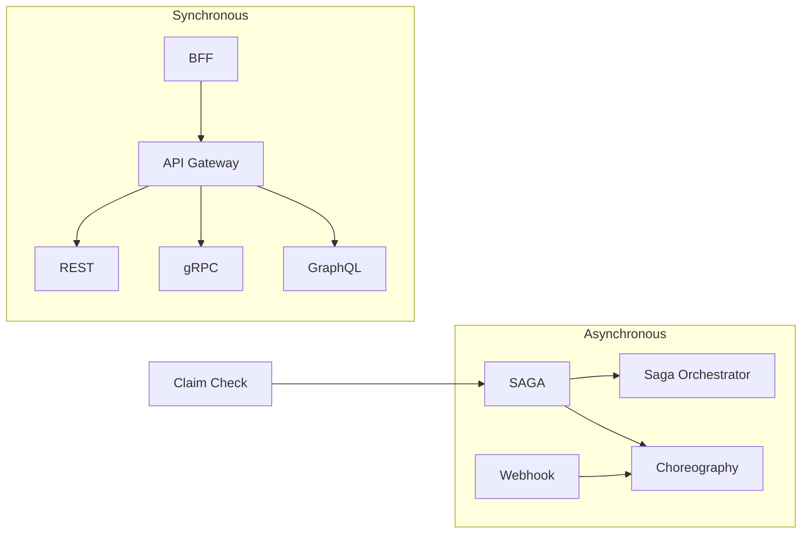

# Integration Patterns

How services communicate. Integration patterns solve the hard problems of distributed systems: coordinating multi-step workflows across service boundaries, choosing the right communication style for each interaction, and managing the payload and contract between producer and consumer.

## Pattern Relationships

Synchronous patterns build a stack from client-facing BFFs through an API gateway down to specific protocols. Asynchronous patterns choose between centralized orchestration and decentralized choreography. Claim check reduces payload size in either model.

---

## Saga

Use when a business operation spans multiple services and you need all-or-nothing semantics without distributed transactions. Each step pairs with a compensating action that undoes it on failure. The saga walks backward through compensations if any step fails. Choose between orchestration (a central coordinator drives the steps) and choreography (each service reacts to events).

!!! tip "Common combinations"
    Saga + Choreography or Saga + Orchestrator. Pick one coordination style. Add Claim Check when saga steps pass large payloads.

See also: [Saga](saga.md) for a full breakdown.

---

## Choreography

Use when services should be loosely coupled and the workflow is simple enough for each service to decide its own next action based on events. There is no central coordinator -- the workflow emerges from services publishing and subscribing to events on a shared bus. Best for workflows with few steps and minimal conditional branching.

!!! tip "Common combinations"
    Choreography + Webhook + Idempotent Consumer. Webhooks push events to external participants; idempotent consumers handle redelivery.

See also: [Choreography](choreography.md) for a full breakdown.

---

## API Gateway

Use when multiple backend services need a unified external API surface. The gateway centralizes routing, authentication, rate limiting, and request transformation in a single entry point. Clients see one stable API regardless of how services are split or redeployed behind it. The gateway must remain a thin policy layer with zero business logic.

!!! tip "Common combinations"
    API Gateway + BFF + Circuit Breaker. BFFs sit in front of the gateway for client-specific shaping; circuit breakers protect the gateway from failing backends.

See also: [API Gateway](api-gateway.md) for a full breakdown.

---

## Webhook

Use when you need to notify an external system about events in near-real-time without that system polling you. The subscriber registers a callback URL; your system POSTs event payloads to it when events occur. Webhooks are the simplest form of event-driven integration for cross-organization communication. They require retry logic, signature verification, and timeout handling on both sides.

!!! tip "Common combinations"
    Webhook + Choreography + Idempotent Consumer. Webhooks extend choreography across organizational boundaries; consumers must handle duplicate deliveries.

---

## Claim Check

Use when messages in a workflow carry large payloads (files, images, large documents) that most participants do not need. The producer stores the payload in a shared store (S3, blob storage) and puts only a reference (the "claim check") in the message. Consumers that need the full payload retrieve it using the reference. This keeps message brokers fast and queues small.

!!! tip "Common combinations"
    Claim Check + Saga + Stream-to-Store. Sagas passing large data between steps use claim checks to keep the message bus lean.

---

## API Patterns Cross-Reference

The following patterns define how individual service endpoints are designed and consumed. They appear throughout the integration layer and are selected based on client needs, performance requirements, and team structure.

### REST

Use when you want a widely understood, resource-oriented API with standard HTTP semantics. REST works well for CRUD operations, public APIs, and any case where cacheability and uniform interface matter. Pair with content negotiation when clients need different representations of the same resource.

### GraphQL

Use when clients need to fetch exactly the data they want in a single request, avoiding over-fetching and under-fetching. Best for client-heavy applications (mobile, SPAs) where bandwidth matters and the data graph is deeply nested. The schema serves as a self-documenting contract.

### gRPC

Use when services need high-performance, strongly-typed communication with streaming support. gRPC uses Protocol Buffers for compact serialization and HTTP/2 for multiplexing. Best for internal service-to-service calls where human readability of the wire format is not needed.

### Backend for Frontend (BFF)

Use when different client types (web, mobile, TV) need different API shapes from the same backend services. Each BFF is a thin, client-specific aggregation layer that calls backend services and returns exactly the shape that client needs. This prevents the API gateway from accumulating client-specific logic.

### Content Negotiation

Use when the same resource needs to be served in multiple formats (JSON, XML, CSV, Protocol Buffers) depending on the client's Accept header. This keeps one endpoint serving all clients instead of creating format-specific endpoints. Pair with REST for clean multi-format APIs.

!!! tip "Choosing between API patterns"
    **REST** for public APIs and standard CRUD. **GraphQL** for complex client queries with nested data. **gRPC** for internal high-throughput service-to-service calls. **BFF** when client diversity demands different API shapes. These are not mutually exclusive -- a system often uses several.
