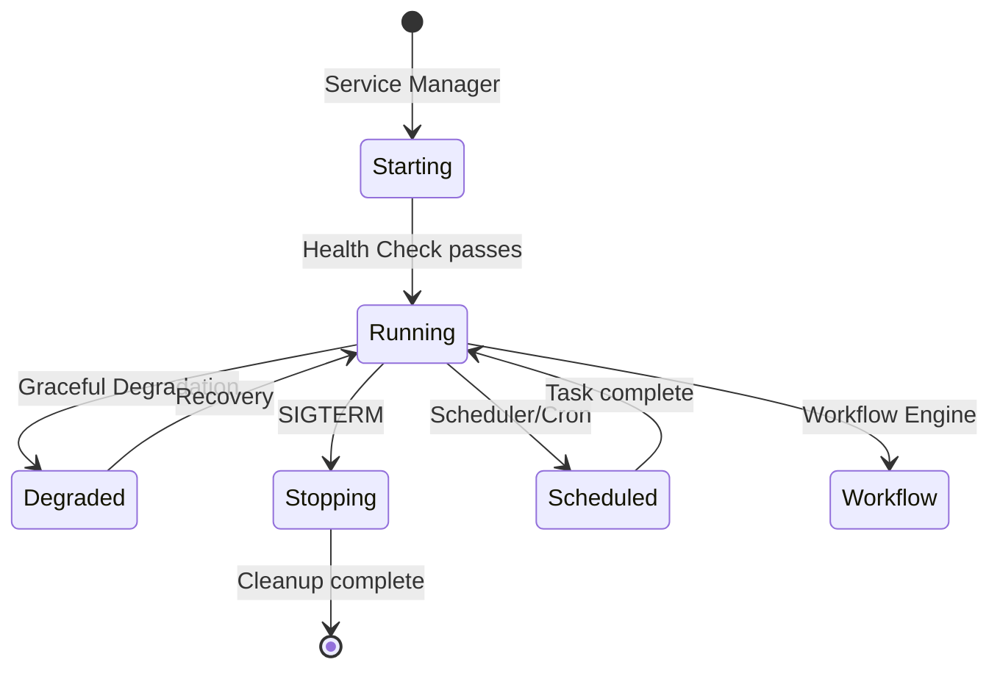

# Lifecycle Patterns

How services start, run, and stop.

Every long-running process goes through phases: initialization, steady-state operation, and shutdown. The patterns in this section govern how those transitions happen, how scheduled and long-running work is managed, and how legacy systems are replaced without downtime.

## Service Lifecycle Overview

A service begins in the **Starting** state, managed by a Service Manager that loads configuration, connects dependencies, and runs initialization. Once health checks pass, the service enters **Running**. From there it may temporarily enter **Degraded** mode (via Graceful Degradation) and recover, hand off work to a **Scheduler** or **Workflow Engine**, or receive a SIGTERM and move to **Stopping** for cleanup.

---

## Service Manager

Manages the full lifecycle of a long-running service: startup, health checking, and graceful shutdown.

Use a Service Manager for any process that runs continuously in a container or on a host. The manager validates configuration and dependencies before the service accepts traffic, runs a health loop while it serves, and orchestrates a clean shutdown on SIGTERM -- draining in-flight requests, flushing buffers, and closing connections. Without this structure, services risk serving traffic before they are ready or losing data on termination.

## Sidecar

Attaches a helper container alongside the main application to handle one cross-cutting infrastructure concern.

Use a Sidecar when you need to add logging, proxying, mTLS, or metrics collection without modifying the application code. The sidecar shares the pod's network and filesystem, so the main container communicates with it over localhost. This keeps business logic and infrastructure concerns cleanly separated and lets you version and upgrade them independently. Watch the lifecycle ordering -- the sidecar must start before the main container and stop after it.

## Scheduler / Cron

Triggers work at defined intervals or calendar times.

Use a Scheduler when work needs to happen periodically -- nightly data exports, hourly cache warming, daily report generation. The scheduler is responsible for triggering, not executing: it fires the job and tracks whether it completed. Keep jobs idempotent so that a missed or repeated trigger does not corrupt state. In Kubernetes, CronJobs handle this natively, but for sub-minute precision or complex dependencies, a dedicated scheduler process is more appropriate.

## Workflow Engine

Coordinates multi-step, long-running processes with explicit state transitions and error handling.

Use a Workflow Engine when a business process spans multiple services, takes minutes to hours, and requires durable state across steps -- order fulfillment, onboarding pipelines, approval chains. The engine persists the workflow state at each step so that a crash mid-process can resume from where it left off. It also provides visibility: you can inspect which step a workflow is on, how long it has been there, and whether it is blocked.

## Strangler Fig

Incrementally replaces a legacy system by routing traffic to new implementations one feature at a time.

Use Strangler Fig when a full rewrite is too risky or too slow. A routing layer (often an API gateway or reverse proxy) sits in front of both the old and new systems. New requests for migrated features go to the new system; everything else still hits the old one. Over time, the old system handles less and less until it can be decommissioned entirely. The critical discipline is never adding new features to the old system once migration begins.

## Database Migration

Evolves the database schema alongside application code without downtime.

Use explicit migration scripts for every schema change -- adding columns, creating indexes, renaming tables. Migrations run as part of the deployment pipeline, in order, and are tracked in a version table so they never run twice. For zero-downtime deploys, follow the expand-contract pattern: first add the new column (expand), deploy code that writes to both old and new, then drop the old column (contract) once all readers have moved.

---

## How They Relate

These patterns are not alternatives to each other; they operate at different scopes and often combine.

- A **Service Manager** governs the process lifecycle. Inside that process, a **Scheduler** triggers periodic jobs and a **Workflow Engine** coordinates multi-step processes.
- **Sidecars** augment any running service with infrastructure capabilities, regardless of what the service does internally.
- **Strangler Fig** operates at the system boundary, controlling which traffic goes to old vs. new implementations. The new service behind the router uses all the other patterns normally.
- **Database Migrations** are a deployment-time concern that every service with persistent state needs, independent of how the service is structured at runtime.
