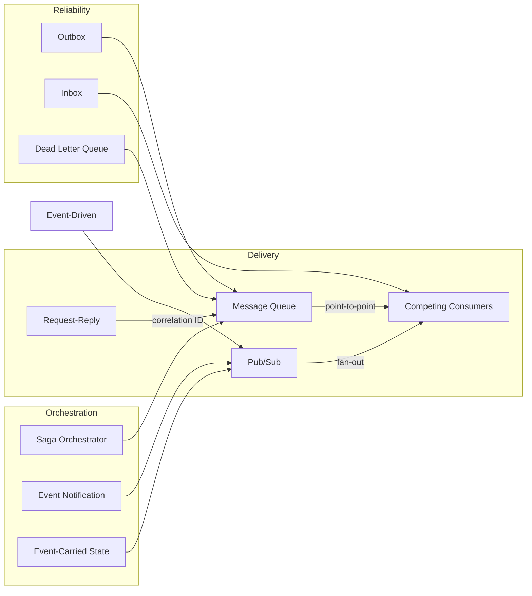

# Messaging Patterns

How messages flow between components.

## Overview

## Decision Guide: Delivery

| Strategy | How it works | Best for |
|----------|-------------|----------|
| Pub/Sub | Publisher broadcasts, all subscribers receive a copy | Fan-out to multiple consumers (notifications, event streams) |
| Message Queue | Point-to-point delivery, one consumer processes each message | Work distribution across a pool of workers |
| Request-Reply | Sender publishes a request with a correlation ID, waits for a response on a reply channel | RPC-style calls over asynchronous messaging infrastructure |

## Delivery

### Pub/Sub

A publisher emits messages to a topic. Every subscriber to that topic receives its own copy of every message. Publishers and subscribers are decoupled; neither knows about the other.

**When to use:** Multiple services need to react to the same event. Notifications, audit logging, building read models from domain events.

**Watch out for:** Subscriber failures are invisible to the publisher. Ordering guarantees vary by implementation. Adding subscribers increases fan-out load.

### Message Queue

A producer sends messages to a queue. Each message is delivered to exactly one consumer. If multiple consumers listen on the same queue, messages are distributed among them.

**When to use:** Background job processing, task distribution, load leveling between a fast producer and slow consumer.

**Watch out for:** Poison messages that fail repeatedly and block the queue. Always pair with a dead letter queue. Message ordering may not be guaranteed under competing consumers.

### Dead Letter Queue

A secondary queue that receives messages that could not be processed after a configured number of retries. Prevents poison messages from blocking the main queue.

**When to use:** Any message queue or topic subscription where processing can fail. Gives operators visibility into failures without losing messages.

**Watch out for:** Dead letter queues that nobody monitors. Set up alerts. Define a process for inspecting, fixing, and replaying failed messages.

### Competing Consumers

Multiple consumer instances listen on the same queue, processing messages in parallel. The broker distributes messages so each is handled by exactly one consumer.

**When to use:** The processing rate of a single consumer cannot keep up with the message volume. You need horizontal scaling of message processing.

**Watch out for:** Message ordering is not guaranteed when consumers process in parallel. If order matters, partition by key so related messages go to the same consumer.

### Request-Reply

The sender publishes a request message containing a correlation ID and a reply-to address. The receiver processes the request and publishes the response to the reply address with the same correlation ID.

**When to use:** You need synchronous-style interactions over asynchronous infrastructure. Useful when direct HTTP calls are not possible (e.g., across network boundaries).

**Watch out for:** Timeouts and correlation tracking add complexity. If you can make a direct HTTP call instead, do that. Reply queues must be cleaned up.

## Reliability

### Outbox

Instead of publishing a message directly, the application writes the message to an outbox table in the same database transaction as the business data. A separate process reads the outbox and publishes to the message broker.

**When to use:** You need exactly-once semantics between a database write and a message publish. Prevents the "dual write" problem where the DB commit succeeds but the publish fails (or vice versa).

**Watch out for:** The outbox relay process must be idempotent and handle restarts gracefully. Polling the outbox table adds latency; change-data-capture is faster but more complex.

### Inbox

The consumer writes incoming messages to an inbox table using the message ID as a deduplication key. Processing reads from the inbox, ensuring each message is handled exactly once even if delivered multiple times.

**When to use:** At-least-once delivery where your consumer must not process duplicates. The counterpart to the Outbox pattern on the receiving side.

**Watch out for:** The inbox table grows without bound unless you prune old entries. The deduplication window must be long enough to cover all possible redeliveries.

## Orchestration

### Saga Orchestrator

A central coordinator drives a multi-step distributed transaction by sending commands to participants and handling their responses. If any step fails, the orchestrator triggers compensating actions.

**When to use:** Complex business workflows spanning multiple services that need all-or-nothing semantics. You want the workflow logic in one place rather than scattered across services.

**Watch out for:** The orchestrator is a single point of failure and can become a bottleneck. It must persist its state to survive restarts. Consider choreography for simpler workflows.

### Event Notification

A service publishes a lightweight event saying "something happened" without including the full details. Interested consumers call back to the source service to fetch the data they need.

**When to use:** You want loose coupling. The publisher does not need to know what data consumers want. Good when payload sizes vary widely across consumers.

**Watch out for:** Consumers make synchronous callbacks, which increases coupling and load on the source. High fan-out can overwhelm the source service.

### Event-Carried State

Events carry the full state needed by consumers, so they never need to call back to the source. Consumers maintain their own local copy of the data.

**When to use:** You want maximum decoupling and autonomy. Consumers can operate even if the source service is down because they have their own copy.

**Watch out for:** Large event payloads. Data duplication across services. Consumers must handle out-of-order events and eventual consistency.

## Event-Driven Architecture

### Event-Driven

A design approach where state changes are communicated as events. Services react to events rather than being called directly. Pub/Sub is the typical transport.

**When to use:** You want loose coupling between services. The system needs to react to changes in multiple places. Natural fit for domains with real-world events (orders placed, payments received).

**Watch out for:** Debugging distributed event flows is harder than tracing synchronous calls. Event schemas must be versioned. Without discipline, event-driven systems become impossible to reason about.
