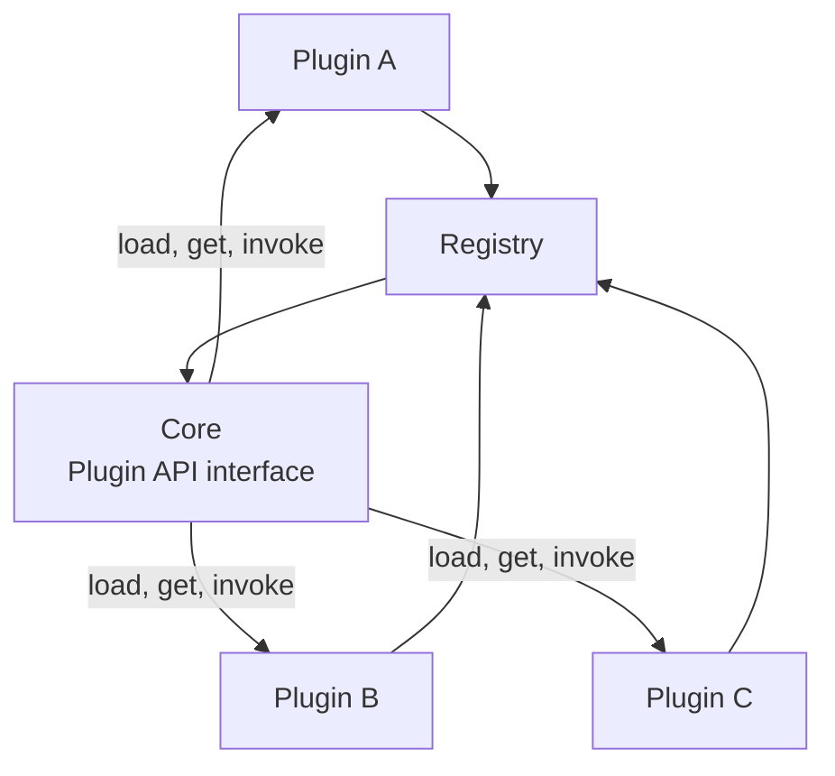

# Plugin Architecture

Allows extending a system's behavior by registering external modules against a stable interface, without modifying the core.

## When to Use

- You want third parties or other teams to extend functionality without changing core code
- The system needs to support multiple implementations of the same capability
- Features should be loadable at startup via configuration, not hardcoded

## How It Works

Plugins implement a versioned **Plugin API** interface. At startup, the **Registry** discovers and loads plugins. The core invokes plugins through the interface without knowing their internals. The core must function (possibly with reduced features) when no plugins are loaded.

## Trade-offs

!!! success "Strengths"
    - New features added without modifying or redeploying the core
    - Clean separation of concerns — plugins are self-contained units
    - Versioned interface protects against silent breakage on core updates

!!! warning "Watch out for"
    - Plugins importing core internals beyond the published API surface
    - No versioning on the plugin interface — core changes break all plugins silently
    - Plugin registration order creating hidden dependencies between plugins
    - Missing lifecycle management (init, start, stop) — leads to orphaned resources
