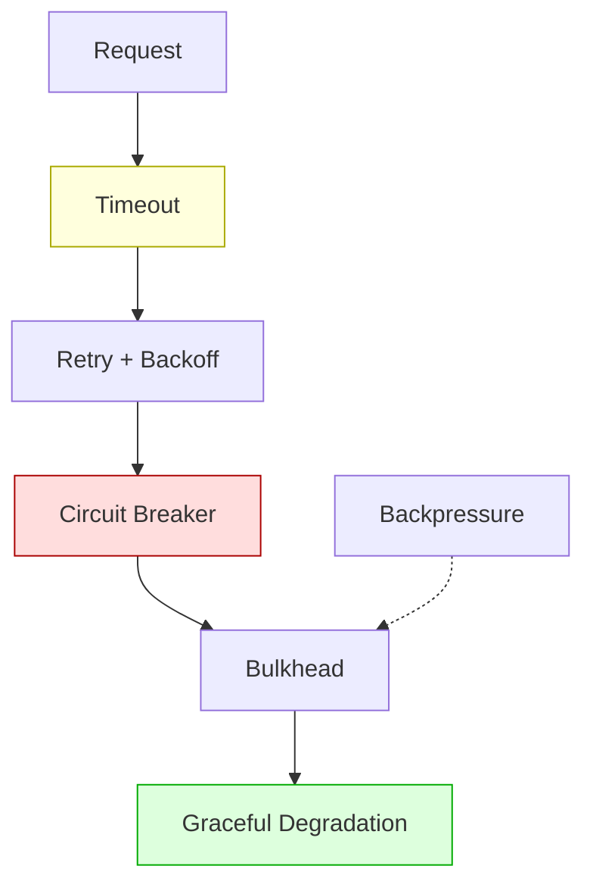

# Resilience Patterns

How the system handles failure.

Resilience is not a single technique -- it is a stack of cooperating defenses. Each layer handles a different failure mode, and together they prevent a small hiccup from becoming a full outage.

## How the Layers Fit Together

Reading top to bottom:

- **Timeout** wraps every outbound call. It puts an upper bound on how long you wait for a response, so a stalled dependency cannot hold your thread forever.
- **Retry with Backoff** wraps the timeout. When a call fails or times out, it re-attempts with exponentially increasing delays and random jitter to avoid synchronized storms.
- **Circuit Breaker** wraps the retry loop. When failures cross a threshold, the breaker opens and rejects calls immediately -- no more retries until a probe succeeds.
- **Bulkhead** isolates resource pools. Each dependency gets its own bounded set of connections or threads, so exhaustion in one pool cannot starve the others.
- **Graceful Degradation** provides the fallback. When a dependency is unavailable, the system returns a cached result, a default, or a reduced feature set instead of an error.
- **Backpressure** is orthogonal to the stack. It operates between producer and consumer to prevent unbounded queuing, regardless of which layer is active.

---

## Timeout

Puts an upper bound on how long a caller waits for a response.

Use timeouts when you call anything outside your process -- databases, HTTP APIs, message brokers. Without a timeout, a single hung connection can tie up a thread indefinitely and cascade into resource exhaustion. Set the value based on observed p99 latency plus headroom, not on gut feeling.

## Retry with Backoff

Automatically re-attempts a failed or timed-out call with increasing delays.

Use retries when the failure is likely transient -- network blips, brief unavailability, rate-limit resets. The operation must be idempotent or safe to repeat. Always cap the number of attempts and add random jitter to the delay so that multiple callers do not all retry at the same instant.

## Circuit Breaker

Stops calling a dependency that is consistently failing, giving it time to recover.

Use a circuit breaker around any external dependency where repeated failures would waste resources and delay recovery. The breaker tracks failure counts, and when a threshold is crossed it opens -- rejecting all calls instantly. After a cooldown, a single probe checks whether the dependency has recovered. This pattern makes failure visible and controllable.

## Bulkhead

Isolates resources into separate bounded pools so one failing dependency cannot exhaust the whole system.

Use bulkheads whenever your service talks to more than one external dependency. Without isolation, a slow database can consume every connection in a shared pool, starving the cache and the API client at the same time. Each pool has its own size limit, and exhaustion triggers fast rejection rather than unbounded queuing.

## Backpressure

Signals a fast producer to slow down when the consumer cannot keep up.

Use backpressure between any two stages where the producer can outrun the consumer -- message pipelines, streaming ingestion, batch importers. The mechanism can be a bounded queue that blocks or rejects on full, an HTTP 429 response, or TCP flow control. Without it, queues grow without limit until memory runs out.

## Graceful Degradation

Returns a reduced but still useful response when a dependency is unavailable.

Use graceful degradation for any feature where "something" is better than "nothing." A product page can show cached reviews instead of live ones. A dashboard can display stale metrics with a staleness badge. The key is to decide what the fallback looks like *before* the outage, not during it.

---

## Decision Tree

Use this when deciding which resilience layers a service needs.

1. **Does the service make outbound calls?**
    - Yes: add a **Timeout** to every call. This is non-negotiable.
2. **Are transient failures expected?**
    - Yes, and the call is idempotent: add **Retry with Backoff**.
    - No, or not idempotent: skip retries, fail immediately after timeout.
3. **Could sustained failure cascade?**
    - Yes: wrap the retry loop in a **Circuit Breaker**.
4. **Does the service talk to multiple dependencies?**
    - Yes: add **Bulkheads** -- one pool per dependency.
5. **Is there a producer-consumer boundary?**
    - Yes: add **Backpressure** with bounded queues.
6. **Is partial functionality acceptable during outage?**
    - Yes: implement **Graceful Degradation** with a defined fallback for each dependency.

Start from the top and add layers as needed. Most production services end up with at least timeout + retry + circuit breaker. Bulkheads and graceful degradation come next as the system matures.
