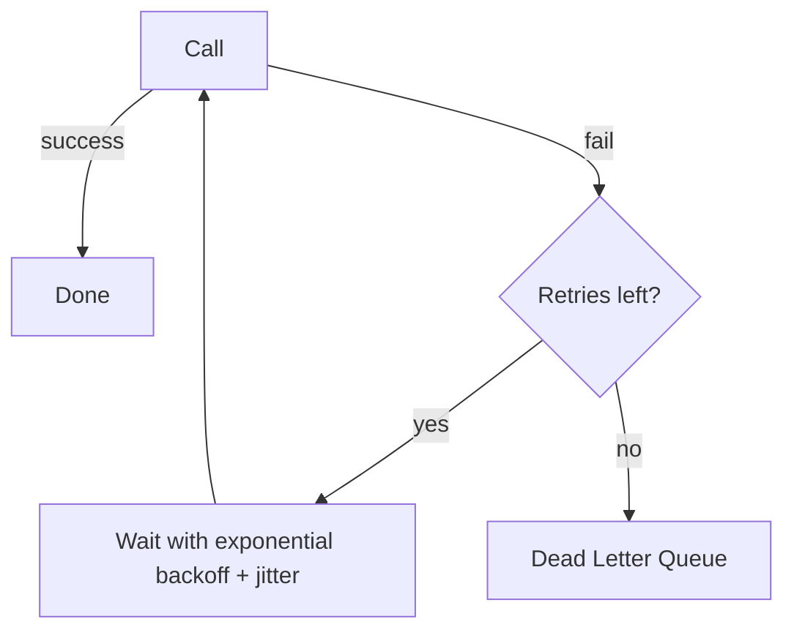

# Retry with Backoff

Automatically re-attempts a failed operation with increasing delays between tries.

## When to Use

- Transient failures are common (network blips, brief service unavailability)
- The operation is idempotent or can be made safe to repeat
- You want graceful recovery without manual intervention

## How It Works

On failure, the caller waits an exponentially increasing delay (e.g., 1s, 2s, 4s) plus random jitter to avoid thundering herd, then retries. After exhausting the retry budget, the message goes to a dead-letter queue for later inspection.

## Trade-offs

!!! success "Strengths"
    - Handles transient errors transparently — callers see eventual success
    - Jitter prevents synchronized retry storms after an outage
    - Dead-letter path ensures nothing is silently lost

!!! warning "Watch out for"
    - Retrying non-idempotent operations without deduplication causes duplicates
    - Fixed-delay retries (no backoff) cause thundering herd on recovery
    - No max retry limit means stuck requests consume resources indefinitely
    - Retrying non-retryable errors (e.g., 400 Bad Request) wastes time — classify errors first
