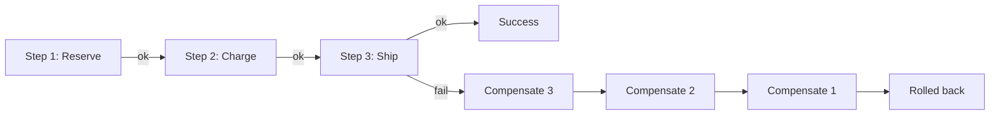

# Saga

Coordinates a multi-step distributed transaction by pairing each step with a compensating rollback action.

## When to Use

- A business operation spans multiple services and you need all-or-nothing semantics
- Two-phase commit is too expensive or not available across your datastores
- Each step has a natural "undo" (cancel order, release reservation, refund payment)

## How It Works

Each step executes in sequence. If any step fails, the saga walks backward through compensating actions to undo previously completed steps. A saga coordinator tracks which steps have completed so it knows where to start compensating.

## Trade-offs

!!! success "Strengths"
    - Achieves consistency across services without distributed locks
    - Each service stays autonomous — no shared database required
    - Works naturally with event-driven architectures

!!! warning "Watch out for"
    - Missing compensation for even one step means partial rollback (data inconsistency)
    - Compensating actions must be idempotent — they may be retried on failure
    - Adds complexity; use a simple transaction if the operation fits in one service
    - Sagas that hang need timeout handling to avoid stuck-in-progress states
