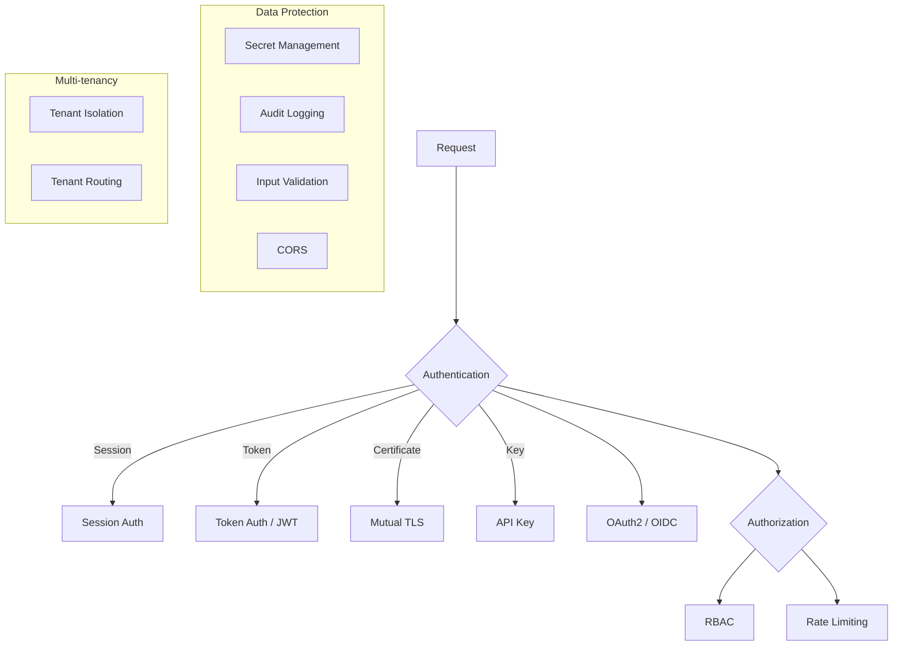

# Security Patterns

How access and trust are managed. These patterns cover authentication (proving identity), authorization (controlling access), data protection, and multi-tenant isolation.

## Overview

Authentication sits at the front door. Every request passes through it before reaching authorization. Data protection and multi-tenancy operate as cross-cutting concerns throughout the stack.

---

## Authentication

These patterns answer: *who is making this request?*

### OAuth2 / OIDC

Delegates authentication to an identity provider. The client receives an authorization code, exchanges it for tokens, and presents the access token on subsequent requests. OIDC adds an ID token with user claims on top of OAuth2.

Use when you have third-party login (Google, GitHub), need single sign-on across services, or want to separate your identity provider from your application.

### Session Auth

Server creates a session after login, stores it server-side (in-memory, Redis, or database), and gives the client a session ID in a cookie. Every subsequent request includes that cookie. The server looks up session state.

Use when you control both client and server, the client is a web browser, and you want simple revocation (delete the server-side session). Not suited for service-to-service calls.

### Token Auth (JWT)

Client receives a signed JWT after authentication. The token contains claims (user ID, roles, expiry) and is verified by any service that has the signing key. No server-side session storage needed.

Use for stateless service-to-service auth, mobile clients, or when you need to scale horizontally without shared session state. Be aware that revocation requires extra infrastructure (blocklist or short-lived tokens with refresh).

### Mutual TLS (mTLS)

Both client and server present X.509 certificates. The server verifies the client certificate against a trusted CA. Provides strong identity for service-to-service communication without tokens.

Use for internal service mesh traffic where every workload has a certificate (often managed by the mesh control plane). Heavier to set up than token auth but harder to spoof.

### API Key Auth

Client includes a static key in a header or query parameter. The server validates the key against a registry.

Use for programmatic access, CI/CD integrations, and third-party API consumers. API keys identify the caller but carry no claims -- pair with rate limiting and scoping. Rotate keys regularly and never embed them in client-side code.

---

## Authorization

These patterns answer: *is this caller allowed to do this?*

### RBAC (Role-Based Access Control)

Users are assigned roles. Roles map to permissions. Access checks compare the required permission against the user's role permissions. The mapping is stored centrally (database table, policy file, or identity provider).

Use when you have well-defined roles (admin, editor, viewer) and permissions map cleanly to those roles. If you need attribute-based rules (access depends on resource ownership, time of day, etc.), RBAC alone will not be enough -- look at ABAC or policy engines like OPA.

### Rate Limiting

Constrains request throughput per caller, per endpoint, or globally. Common algorithms: token bucket (smooth burst), sliding window (per-interval count), and leaky bucket (constant drain rate).

Use everywhere. Even internal services should rate-limit to prevent cascade failures. Implement at the API gateway for global limits and at individual services for fine-grained control.

---

## Data Protection

### Secret Management

Secrets (database passwords, API keys, signing keys) are stored in a dedicated vault (HashiCorp Vault, AWS KMS, `pass` store) and injected at runtime. Never committed to source control. Never passed as plaintext environment variables in manifests.

Use always. There is no valid reason to hardcode credentials.

### Audit Logging

Immutable, append-only log recording who did what, when, and to which resource. Separate from application logs. Stored durably and tamper-resistant. Includes actor identity, action, resource, timestamp, and outcome (success/failure).

Use when you need compliance, forensics, or debugging of access-control decisions. Write audit events as a side effect of every mutating operation.

### Input Validation

Validates and sanitizes every input at the API boundary before it reaches business logic. Includes schema validation (types, required fields, ranges), format validation (email, URL, date), and sanitization (strip HTML, escape SQL).

Use at every entry point. Reject invalid input early with clear error messages. Do not rely on client-side validation alone.

### CORS (Cross-Origin Resource Sharing)

Server declares which origins, methods, and headers are allowed for cross-origin requests. The browser enforces this via preflight OPTIONS requests.

Use when your API is consumed by browser clients on a different origin. Be explicit -- avoid `Access-Control-Allow-Origin: *` in production. Whitelist specific origins.

---

## Multi-tenancy

### Tenant Isolation

Data belonging to one tenant is invisible to others. Strategies range from separate databases (strongest isolation, highest cost) to shared schema with row-level filtering (lowest cost, requires discipline).

| Strategy | Isolation | Cost | Complexity |
|----------|-----------|------|------------|
| Separate database per tenant | Strongest | High | Medium |
| Separate schema per tenant | Strong | Medium | Medium |
| Shared schema, row-level filter | Moderate | Low | High (must enforce everywhere) |

Use row-level filtering for SaaS applications with many small tenants. Use separate databases when tenants have strict compliance or performance requirements.

### Tenant Routing

Incoming requests are routed to the correct tenant context. Tenant is identified from subdomain, header, path segment, or JWT claim. The routing layer sets the tenant context before any business logic runs.

Use when you need to support multiple tenants in a shared deployment. Pair with tenant isolation to ensure routing errors cannot leak data.

---

## Choosing an Authentication Pattern

| Scenario | Recommended |
|----------|------------|
| Browser-based web app | Session auth or OAuth2/OIDC |
| Single-page app (SPA) | OAuth2 with PKCE |
| Mobile app | OAuth2 with PKCE |
| Service-to-service (internal) | mTLS or JWT |
| Third-party API consumer | API key + rate limiting |
| Microservices behind a mesh | mTLS (managed by mesh) |

Most production systems combine multiple patterns: OAuth2 at the edge, JWT between services, mTLS inside the mesh, and API keys for external integrations.
