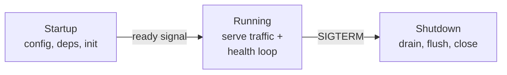

# Service Manager

Manages the full lifecycle of a long-running service: startup, health checking, and graceful shutdown.

## When to Use

- You are building a service that runs continuously in a container or on a host
- The service needs to validate configuration and dependencies before accepting traffic
- Graceful shutdown matters — in-flight requests must drain and buffers must flush

## How It Works

On **startup**, the service loads configuration, connects to dependencies, and runs initialization. It does not accept traffic until it signals readiness. While **running**, a health loop reports liveness and readiness to the orchestrator. On **shutdown** (SIGTERM), the service stops accepting new requests, drains in-flight work, flushes buffers, and closes connections before exiting.

!!! note "In our stack"
    The **orchestrator** library implements this pattern with structured startup/shutdown phases, health check registration, and signal handling.

## Trade-offs

!!! success "Strengths"
    - Clean lifecycle prevents serving traffic before dependencies are ready
    - Graceful shutdown avoids data loss from killed in-flight requests
    - Health checks let the orchestrator route traffic only to healthy instances

!!! warning "Watch out for"
    - Serving traffic before dependencies are connected (premature readiness)
    - Shutdown that kills in-flight requests without draining (data loss)
    - Health checks that always return healthy regardless of actual state
    - No distinction between liveness probes (is it alive?) and readiness probes (can it serve?)
