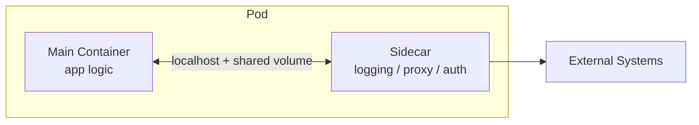

# Sidecar

Attaches a helper container alongside the main application container to handle cross-cutting infrastructure concerns.

## When to Use

- You want to add logging, proxying, auth, or metrics collection without modifying the application
- Multiple services need the same infrastructure capability but are written in different languages
- You need to upgrade infrastructure behavior independently from application releases

## How It Works

The sidecar runs as a separate container in the same pod (or host). It shares the network and filesystem with the main container, handling one cross-cutting concern — such as log shipping, mTLS proxying, or metrics export — so the application stays focused on business logic.

## Trade-offs

!!! success "Strengths"
    - Separates infrastructure from business logic cleanly
    - Can be maintained and versioned independently
    - Reusable across services regardless of language or framework

!!! warning "Watch out for"
    - Business logic creeping into the sidecar — it should be infrastructure only
    - Too many sidecars per pod — resource overhead adds up quickly
    - Lifecycle mismatch: sidecar must start before and stop after the main container
    - Main container should degrade gracefully if the sidecar is temporarily unavailable
