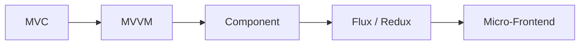
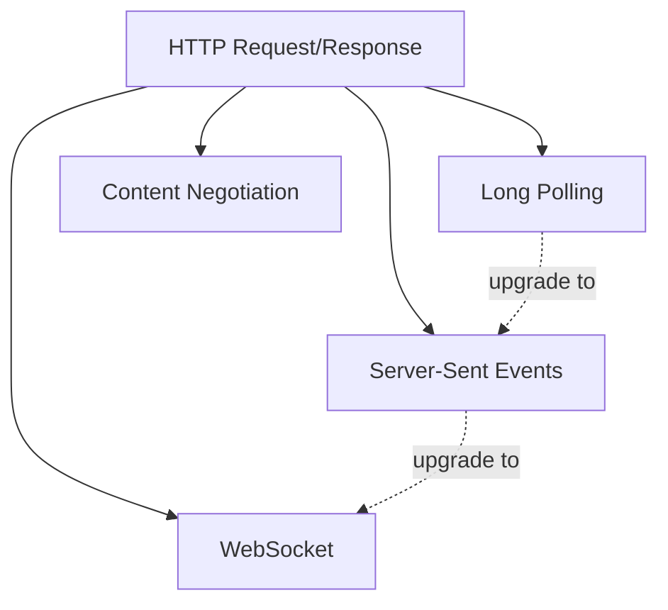
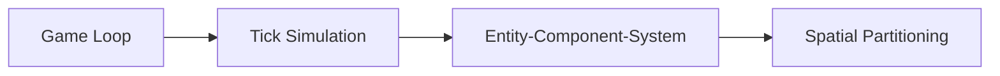
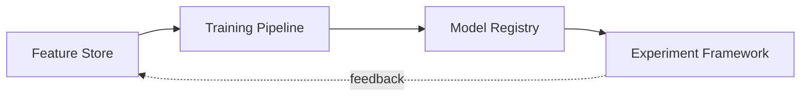
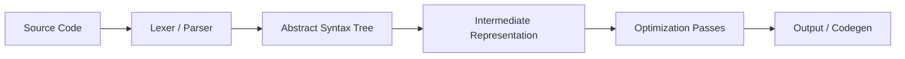
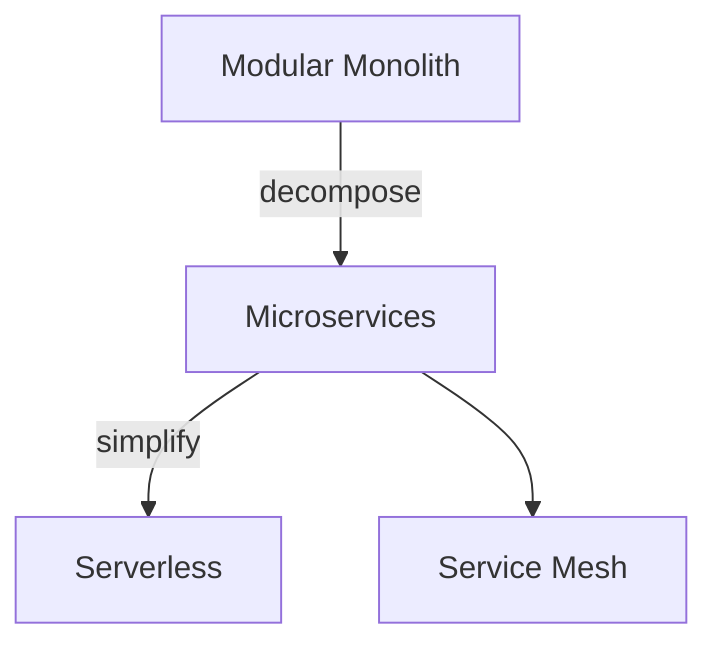
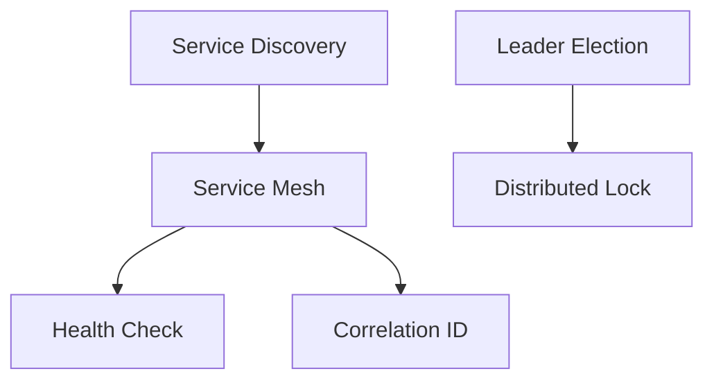
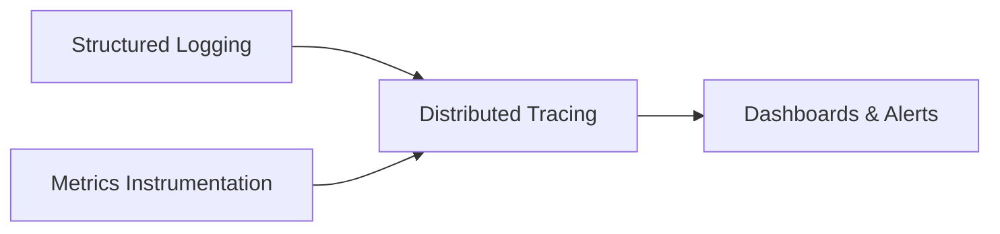
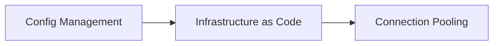

# Specialized Patterns

Domain-specific patterns that appear in particular problem spaces. These go beyond general-purpose architecture into the toolkits of frontend, networking, realtime, ML, compiler, and infrastructure engineers.

---

## Frontend

How user interfaces are structured, how state flows, and how large UIs decompose.

**MVC (Model-View-Controller)** -- Separates data (model), presentation (view), and input handling (controller). The controller updates the model; the model notifies the view. Use as the foundation for server-rendered web apps and desktop applications. Rails, Django, and Spring MVC all implement this.

**MVVM (Model-View-ViewModel)** -- The view binds to a ViewModel that exposes observable properties. When the ViewModel changes, the view updates automatically. Use in data-binding frameworks (WPF, SwiftUI, Vue). Eliminates manual DOM manipulation by making the view a pure function of ViewModel state.

**Component** -- Self-contained UI units with their own props, state, and render logic. Components compose into trees. Use in React, Vue, Svelte, and any modern UI framework. The component boundary is the unit of reuse and testing.

**Flux / Redux** -- Unidirectional data flow: actions describe what happened, a reducer computes the new state, the store holds it, and the view renders from it. Use when shared state across many components becomes hard to track. The single store and pure reducers make state changes predictable and debuggable.

**Micro-Frontend** -- Independently deployable frontend modules, each owned by a different team. Modules integrate at runtime via module federation, iframes, or web components. Use when multiple teams need to ship frontend changes independently. Adds complexity -- only justified at scale.

---

## Networking

How network communication is managed for different latency and directionality requirements.

**WebSocket** -- Persistent bidirectional connection over a single TCP socket. After an HTTP upgrade handshake, both client and server can send frames at any time. Use for chat, live dashboards, multiplayer games, and any scenario requiring low-latency bidirectional messaging.

**Server-Sent Events (SSE)** -- One-way server-to-client push over a long-lived HTTP connection. The server sends text events; the client receives them via the `EventSource` API. Use for live feeds, notifications, and log tailing. Simpler than WebSocket when you only need server-to-client flow.

**Long Polling** -- Client sends a request; server holds it open until data is available, then responds. Client immediately sends another request. Use as a fallback when SSE and WebSocket are not available. Higher overhead than SSE but works through proxies and firewalls that block persistent connections.

**Content Negotiation** -- Client and server agree on response format via `Accept` and `Content-Type` headers. A single endpoint can serve JSON, XML, or Protocol Buffers depending on what the client requests. Use when your API serves clients with different format requirements.

---

## Realtime

Patterns for simulation, game engines, and systems that must process continuous state at fixed rates.

**Entity-Component-System (ECS)** -- Entities are plain IDs. Components are pure data bags attached to entities. Systems iterate over entities with specific component combinations and perform logic. Use for game engines and simulations where you need high performance and flexible composition. ECS gives you cache-friendly data layouts and avoids deep inheritance hierarchies.

**Game Loop** -- A fixed-timestep loop: read input, update state, render output. The loop runs at a constant rate (e.g., 60 ticks/sec) regardless of render speed. Use for any real-time application that needs deterministic updates. The loop decouples simulation speed from frame rate.

**Spatial Partitioning** -- Divides space into regions (quadtree, octree, grid, spatial hash) so that neighbor queries are fast. Instead of checking every entity against every other entity (O(n^2)), you only check entities in the same or adjacent regions. Use for collision detection, range queries, and visibility culling.

**Tick Simulation** -- State advances in discrete time steps. Each tick processes all entities, applies physics, resolves collisions, and produces the next state. Deterministic: given the same inputs, the same sequence of ticks produces the same output. Use for multiplayer games (lockstep), physics engines, and any system requiring reproducible behavior.

---

## ML (Machine Learning)

Patterns for managing the lifecycle of data, features, models, and experiments.

**Feature Store** -- Centralized repository of computed features, serving both training (offline, batch) and inference (online, low-latency). Features are computed once and reused across models. Use when multiple models share features, or when you need to guarantee that training and serving use the same feature definitions.

**Model Registry** -- Versioned storage for trained models with metadata (metrics, parameters, lineage). Models transition through stages: staging, production, archived. Use to track which model version is serving traffic, roll back to previous versions, and audit model lineage.

**Training Pipeline** -- End-to-end data-to-model workflow: data ingestion, feature computation, model training, evaluation, and registration. Pipelines are reproducible and parameterized. Use when training is complex enough that manual steps would cause errors or inconsistency.

**Experiment Framework** -- A/B testing infrastructure with variant assignment (bucketing), metric collection, and statistical analysis. Use to measure the impact of model changes, feature launches, or UI variations on real users. Requires a clear primary metric, sufficient traffic, and proper randomization.

---

## Compiler

Patterns for language tooling, DSL implementation, and structured text processing.

**Lexer / Parser** -- The lexer (tokenizer) breaks source text into tokens. The parser arranges tokens into a structured tree according to grammar rules. Use when you need to process structured text: programming languages, configuration formats, query languages, template engines.

**Abstract Syntax Tree (AST)** -- A tree representation of parsed code where each node represents a language construct (expression, statement, declaration). Concrete syntax (semicolons, parentheses) is discarded. Use as the central data structure for analysis, transformation, and code generation.

**Intermediate Representation (IR)** -- A lower-level representation between the AST and final output. The IR strips away source-language specifics and exposes operations that are easier to optimize. Use when you need optimization passes (constant folding, dead code elimination, inlining) or when targeting multiple output formats from a single frontend.

---

## Architecture

High-level system topology decisions that shape everything else.

**Microservices** -- Multiple independently deployable services, each owning its data and communicating over the network. Use when you have multiple teams, need independent scaling, or need different technology stacks per service. The tax is high: distributed transactions, network latency, operational complexity.

**Modular Monolith** -- A single deployable unit with strong internal module boundaries. Modules communicate through defined interfaces, not direct database access. Use as a starting point. You get the simplicity of a monolith with the maintainability of defined boundaries. Decompose into microservices later if needed.

**Serverless / FaaS** -- Stateless functions triggered by events (HTTP, queue, schedule). The platform manages scaling, provisioning, and lifecycle. Use for event-driven workloads with variable traffic, glue logic, and processing that does not require persistent connections.

---

## Distributed Systems

Coordination and consistency patterns for systems spanning multiple nodes.

**Service Mesh** -- A sidecar proxy layer (Envoy, Linkerd) that handles service-to-service communication concerns: mTLS, retries, load balancing, observability. Services talk to their local proxy; the proxy handles the rest. Use when you have many services and want to move cross-cutting communication concerns out of application code.

**Leader Election** -- One node is elected leader among a group. The leader holds a lease with a TTL. If the leader fails, a new election occurs. Use for tasks that must run on exactly one node: cron jobs, partition assignment, cache warming.

**Distributed Lock** -- Mutual exclusion across nodes with a TTL. Implemented via Redis (Redlock), ZooKeeper, or etcd. Use when multiple instances must coordinate access to a shared resource. Always set a TTL to prevent deadlocks from crashed holders.

**Health Check** -- Liveness probes (is the process alive?) and readiness probes (can it serve traffic?) reported to the orchestrator. Include dependency health in readiness checks. Use in every service running in Kubernetes or a similar orchestrator.

**Correlation ID** -- A unique ID attached to the initial request and propagated through every service call, log entry, and message. Use for distributed tracing and debugging. Without correlation IDs, tracing a request through ten services is nearly impossible.

**Service Discovery** -- Services register their endpoints with a registry (Consul, etcd, DNS). Callers look up endpoints by service name. Use when service locations are dynamic (containers, autoscaling). DNS-based discovery is simplest; registry-based adds health checking and metadata.

---

## Observability

Patterns for understanding what your system is doing in production.

**Structured Logging** -- Log entries as JSON objects with key-value fields instead of free-form text. Include timestamp, level, service, correlation ID, and context fields. Use everywhere. Structured logs are queryable; unstructured logs are not.

**Metrics Instrumentation** -- Expose counters, gauges, and histograms via a client library (Prometheus client, OpenTelemetry). Label with dimensions like method, status, and endpoint. Use for dashboards and alerting. Watch cardinality -- too many label combinations will overwhelm your metrics store.

**Distributed Tracing** -- Trace context (trace ID, span ID) propagated across service boundaries via headers. Each service creates spans representing its work. Use OpenTelemetry. Traces show you the full lifecycle of a request across services, including latency at each hop.

---

## Infrastructure

Patterns for provisioning, configuration, and resource management.

**Configuration Management** -- 12-factor style: config comes from environment variables, with hierarchical overrides (defaults, environment-specific, secrets). No config in code. Use a config library that merges layers and validates at startup.

**Infrastructure as Code (IaC)** -- Define infrastructure in declarative files (Terraform, Pulumi, CloudFormation). Changes go through version control and CI/CD. Use for everything -- servers, networks, DNS, monitoring rules. If it is not in code, it will drift.

**Connection Pooling** -- Maintain a pool of reusable connections to databases, HTTP services, or message brokers. Connections are acquired from the pool, used, and returned. Use to avoid the overhead of establishing connections on every request. Configure pool size, idle timeout, and max lifetime.
