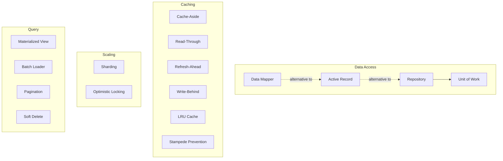

# Storage Patterns

How data is persisted and accessed.

## Overview

## Decision Guide: Caching

| Strategy | How it works | Best for |
|----------|-------------|----------|
| Cache-Aside | Caller checks cache, loads from DB on miss, writes to cache | Simple cases where the caller can manage cache lifecycle |
| Read-Through | Cache itself loads from DB on miss, transparent to caller | Read-heavy workloads where you want the cache to own data loading |
| Write-Behind | Cache accepts writes and flushes to DB asynchronously | Write-heavy workloads where slight write lag is acceptable |
| Refresh-Ahead | Cache proactively refreshes entries before they expire | Hot keys where you cannot tolerate any cache-miss latency |

## Data Access

### Repository

Mediates between the domain layer and the data mapping layer. Client code works with domain objects; the repository handles all persistence details behind a collection-like interface.

**When to use:** You want to decouple business logic from storage technology, swap databases in tests, or centralize query logic.

**Watch out for:** Repositories that grow into god objects with dozens of query methods. Keep them focused on one aggregate root.

### Unit of Work

Tracks all changes made during a business transaction and commits them as a single atomic operation.

**When to use:** Multiple objects change together and must be persisted consistently. Often paired with Repository.

**Watch out for:** Long-lived units of work that hold database connections open. Keep transactions short.

### Active Record

A domain object that wraps a database row, carries both data and persistence methods (`save()`, `delete()`, `find()`).

**When to use:** Simple CRUD applications where domain objects map one-to-one with database tables. Quick to set up and easy to understand.

**Watch out for:** Business logic and persistence logic tangling together. As the domain grows complex, Active Record fights you.

### Data Mapper

A layer of mappers that moves data between domain objects and the database while keeping them independent. Neither side knows about the other.

**When to use:** Complex domains where you need full control over how objects map to tables. The domain model should not know about the database schema.

**Watch out for:** More infrastructure code than Active Record. Overkill for simple CRUD apps.

## Caching

### Cache-Aside (Lazy Loading)

The application checks the cache before reading from the database. On a miss, it loads from the database and populates the cache for next time.

**When to use:** General-purpose caching. Works well when reads far outnumber writes and cache misses are tolerable.

**Watch out for:** Stale data after writes. The application must invalidate or update cache entries when the underlying data changes.

### Read-Through

The cache sits between the application and the database. On a miss, the cache itself fetches the data, stores it, and returns it. The application only ever talks to the cache.

**When to use:** You want to simplify application code by letting the cache manage data loading. Works well with cache libraries that support read-through natively.

**Watch out for:** Cache and database must stay synchronized. First-time reads are always slow (cold cache penalty).

### Refresh-Ahead

The cache proactively refreshes entries that are about to expire, before any caller requests them. Predictions are based on recent access patterns.

**When to use:** Hot keys with predictable access patterns where even a single cache miss is expensive (e.g., homepage data, configuration lookups).

**Watch out for:** Wasted work refreshing entries that nobody actually reads. Needs good heuristics for predicting which keys to refresh.

### Write-Behind (Write-Back)

The application writes to the cache, which acknowledges immediately. The cache asynchronously flushes writes to the database in the background.

**When to use:** Write-heavy workloads where you can tolerate a small window of potential data loss. Reduces database write pressure.

**Watch out for:** Data loss if the cache crashes before flushing. Not suitable when writes must be durable immediately.

### Cache Stampede Prevention

Protects against many threads simultaneously loading the same cache entry after it expires. Only one thread fetches while others wait.

**When to use:** High-traffic keys where expiration would cause a thundering herd of database queries.

**Watch out for:** The lock/lease mechanism itself becoming a bottleneck. Consider probabilistic early expiration as a simpler alternative.

### LRU Cache

An in-process cache that evicts the least recently used entry when it reaches capacity. Fast, no network hop.

**When to use:** Hot data that fits in memory and does not need to be shared across processes. Configuration, parsed templates, computed results.

**Watch out for:** Each process holds its own copy (no sharing). Stale data if the source changes without notification.

## Scaling

### Sharding

Distributes data across multiple databases or partitions based on a shard key (e.g., user ID, tenant ID). Each shard holds a subset of the data.

**When to use:** A single database cannot handle the write volume, storage size, or query load. You need horizontal scale-out.

**Watch out for:** Cross-shard queries are expensive or impossible. Shard key choice is critical and hard to change later. Uneven data distribution creates hot shards.

### Optimistic Locking

Allows concurrent access by attaching a version number or timestamp to each record. On update, the version is checked; if it changed, the update is rejected and the caller retries.

**When to use:** Conflicts are rare, but when they happen you need to detect them. Avoids holding database locks during long operations.

**Watch out for:** High-contention scenarios where retries pile up. Not a substitute for pessimistic locks when conflicts are frequent.

## Query

### Materialized View

A precomputed query result stored as a concrete table or document. Refreshed periodically or on change.

**When to use:** Expensive aggregations or joins that are read frequently. Dashboards, reporting, denormalized read models in CQRS.

**Watch out for:** Staleness between refreshes. Storage cost of duplicated data. Refresh logic that silently breaks.

### Batch Loader

Accumulates multiple individual data requests and executes them as a single batch query. Solves the N+1 query problem.

**When to use:** GraphQL resolvers, ORM lazy loading, or any code path that makes many small queries for related data.

**Watch out for:** Batch windows that are too long (added latency) or too short (batches of one). Requires a framework or pattern like DataLoader.

### Pagination

Returns results in fixed-size pages rather than all at once. Cursor-based pagination uses an opaque token; offset-based uses page numbers.

**When to use:** Any list endpoint where the full result set could be large.

**Watch out for:** Offset pagination breaks when data is inserted or deleted between pages. Cursor pagination is more reliable but harder to implement. Always set a maximum page size.

### Soft Delete

Marks records as deleted (e.g., `deleted_at` timestamp) instead of physically removing them. Queries filter out soft-deleted rows.

**When to use:** You need audit trails, undo capability, or must retain data for compliance while hiding it from users.

**Watch out for:** Every query must include the soft-delete filter. Unique constraints need special handling. Storage grows without bound unless you eventually purge.
