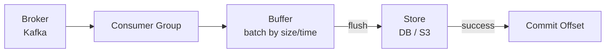

# Stream-to-Store

Consumes events from a streaming platform, buffers them, and flushes batches to a persistent store.

## When to Use

- You need to land streaming data (e.g., from Kafka) into a database, data lake, or object store
- Individual writes per message are too expensive — batching is required
- Exactly-once or at-least-once delivery semantics matter for correctness

## How It Works

A consumer group reads from the broker into an in-memory buffer. The buffer flushes when it hits a size or time threshold. Offsets are committed only after a successful store write, so nothing is lost if the flush fails.

!!! note "In our stack"
    The **stoik** library implements this pattern with configurable flush triggers, offset management, and dead-letter handling.

## Trade-offs

!!! success "Strengths"
    - Batching reduces write amplification and cost on the target store
    - Offset-after-flush guarantees at-least-once delivery
    - Consumer group provides horizontal scaling and rebalancing

!!! warning "Watch out for"
    - Auto-commit advancing offsets regardless of flush success (data loss)
    - Unbounded buffer with no size limit — memory exhaustion on slow stores
    - No dead-letter path for permanently unprocessable messages
    - Consumer group rebalancing can cause duplicates if not handled carefully
