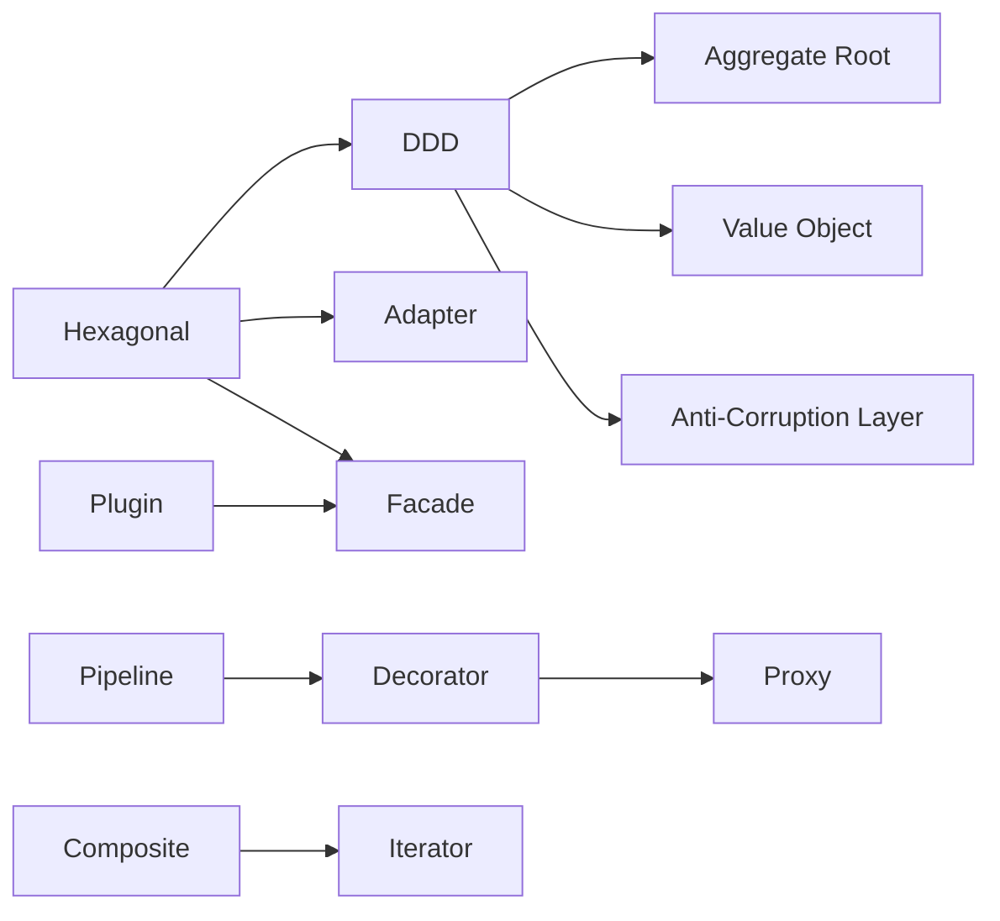

# Structural Patterns

How code is organized within a service. Structural patterns define module boundaries, dependency direction, and extension points. Choosing the right combination determines how testable, changeable, and understandable your codebase will be over time.

## Pattern Relationships

Arrows show "builds on" or "naturally leads to" relationships. Hexagonal architecture provides the foundation for DDD and adapter-based designs. Pipeline stages often use decorators internally. Composite structures need iterators to traverse them.

---

## Hexagonal (Ports and Adapters)

Use when your domain logic must be testable without infrastructure, when you need multiple entry points (HTTP, CLI, message queue), or when you expect to swap infrastructure without rewriting business logic. The domain defines port interfaces; adapters implement them on both the driving (inbound) and driven (outbound) sides.

!!! tip "Common combinations"
    Hexagonal + DDD + Adapter. Nearly always appears together. The hexagonal boundary defines the ports, DDD organizes the domain behind them, and adapters wire in infrastructure.

See also: [Hexagonal](hexagonal.md) for a full breakdown.

---

## Domain-Driven Design (DDD)

Use when the business domain is complex and is the primary source of project risk. DDD aligns code structure with business boundaries through bounded contexts, aggregates, and a ubiquitous language shared between developers and domain experts. Most valuable when multiple teams own different parts of the system.

!!! tip "Common combinations"
    DDD + Aggregate Root + Value Object + Anti-Corruption Layer. These are DDD building blocks that almost always appear together within a bounded context.

See also: [DDD](ddd.md) for a full breakdown.

---

## Plugin

Use when the system needs to support third-party or team-contributed extensions without modifying core code. Plugins register against a stable versioned interface and are discovered at startup. The core must function with zero plugins loaded, making each plugin fully optional.

!!! tip "Common combinations"
    Plugin + Facade + Adapter. The plugin registers against a facade that hides internal complexity, and adapters translate between plugin-specific logic and the core interface.

See also: [Plugin](plugin.md) for a full breakdown.

---

## Aggregate Root

Use when a cluster of related objects must enforce business invariants together. The aggregate root is the single entry point for all modifications to the cluster -- external code never reaches past it to modify child entities directly. This keeps consistency rules in one place instead of scattered across services.

!!! tip "Common combinations"
    Aggregate Root + Value Object + DDD. Aggregates own value objects and enforce invariants within a single bounded context.

---

## Value Object

Use when a concept is defined entirely by its attributes rather than an identity. Amounts of money, date ranges, email addresses, and coordinates are all value objects. They are immutable, equality is based on content not reference, and they carry their own validation. Replace primitive obsession with value objects to catch bugs at construction time.

!!! tip "Common combinations"
    Value Object + Aggregate Root. Value objects live inside aggregates and carry domain validation.

---

## Anti-Corruption Layer (ACL)

Use when integrating with an external system or another bounded context whose model does not match yours. The ACL translates between the foreign model and your internal domain model, preventing external concepts from leaking into your code. Essential when consuming legacy APIs or third-party services whose schemas you do not control.

!!! tip "Common combinations"
    ACL + DDD + Adapter. The ACL sits at the boundary between bounded contexts, often implemented as a driven adapter in a hexagonal architecture.

---

## Decorator

Use when you need to add behavior to an object without modifying its class. Decorators wrap an existing interface and add cross-cutting concerns like logging, metrics, caching, or retry logic. They compose cleanly because each decorator satisfies the same interface it wraps.

!!! tip "Common combinations"
    Decorator + Proxy + Pipeline. Decorators chain naturally into pipelines, and proxies use the same wrapping technique for access control.

---

## Proxy

Use when you need to control access to an object -- lazy initialization, access checks, remote communication, or caching. A proxy implements the same interface as the real object but intercepts calls to add behavior before or after delegation. Unlike a decorator, the proxy typically controls *whether* the call happens, not just what surrounds it.

!!! tip "Common combinations"
    Proxy + Decorator. Proxies guard access; decorators add behavior. They stack on the same interface.

---

## Adapter

Use when you need to make an existing class or API conform to an interface your code expects. Adapters are the glue between your domain and infrastructure: a Postgres adapter implements your repository port, an HTTP adapter translates requests into domain commands. Every hexagonal architecture has adapters on both sides.

!!! tip "Common combinations"
    Adapter + Hexagonal + Facade. Adapters implement ports; facades simplify the adapter surface for callers.

---

## Facade

Use when a subsystem has a complicated API and callers only need a simplified view. The facade provides a clean, high-level interface that hides internal wiring. It does not add new functionality -- it makes existing functionality easier to use. Good for wrapping SDKs, legacy modules, or multi-step infrastructure setup.

!!! tip "Common combinations"
    Facade + Plugin + Adapter. Plugins often expose a facade so the core can invoke them without understanding internal structure.

---

## Pipeline / Filter

Use when processing consists of a sequence of independent, composable steps. Each filter takes input, transforms it, and passes the result to the next stage. Pipelines make it easy to reorder, add, or remove processing steps. Well suited for data transformation, request processing middleware, and build systems.

!!! tip "Common combinations"
    Pipeline + Decorator + Composite. Pipeline stages are often decorators, and pipelines can branch into composite structures for fan-out processing.

---

## Composite

Use when you need to treat individual objects and groups of objects uniformly. A file system (files and directories), a UI widget tree, or a rule engine with nested conditions are all composites. Clients call the same interface whether they are talking to a leaf or a branch.

!!! tip "Common combinations"
    Composite + Iterator + Visitor. Composites need traversal (iterator) and often need operations defined externally (visitor) to avoid bloating the node interface.

---

## Flyweight

Use when you have a large number of objects that share most of their state. The flyweight pattern extracts shared (intrinsic) state into a pool and keeps only unique (extrinsic) state per instance. Common in rendering engines, character formatters, and caches where thousands of objects would otherwise consume excessive memory.

!!! tip "Common combinations"
    Flyweight + Composite. Large tree structures often flyweight their leaf nodes to reduce memory pressure.

---

## Bridge

Use when you want to vary both an abstraction and its implementation independently. The bridge separates "what something does" from "how it does it" by introducing an interface between them. Useful when you have multiple dimensions of variation -- for example, different notification types (email, SMS, push) across different providers (AWS, Twilio, Firebase).

!!! tip "Common combinations"
    Bridge + Adapter + Hexagonal. The bridge pattern is conceptually similar to hexagonal ports, and adapters often sit on one side of the bridge.
