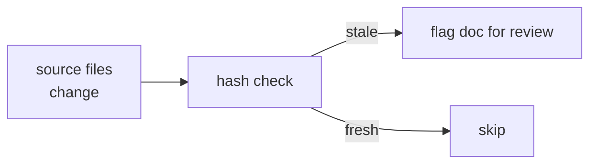

# Source Map

Maps documentation pages to their implementation sources. Used to detect drift.

## How It Works

Each doc page lists the implementation files it describes. The source map lives at `docs/.source-map.yaml`.

## Mapping

| Doc Page | Implementation Sources |
|----------|----------------------|
| **framework/overview.md** | `agents/*/IDENTITY.md` |
| **framework/kords.md** | `kords/*/contract.md`, `skills/kord/SKILL.md` |
| **framework/guards.md** | `agents/scribe/skills/remember/guard.sh` |
| **framework/memory.md** | `KORD.md`, `agents/scribe/skills/remember/generate-kord.sh` |
| **agents/index.md** | `agents/*/IDENTITY.md` |
| **agents/scribe.md** | `agents/scribe/IDENTITY.md`, `agents/scribe/skills/remember/SKILL.md` |
| **agents/beorn.md** | `lib/mcp-agent-server/server.js` |
| **infra/infrastructure.md** | `agents/deployer/IDENTITY.md`, `agents/deployer/skills/infra/manifests/` |
| **infra/monitoring.md** | `agents/sauron/IDENTITY.md` |
| **reference/patterns/** | `agents/designer/memory/patterns/` |
| **reference/libraries/** | `agents/designer/memory/libraries/` |

## Ownership

| Content | Owner | Human docs |
|---------|-------|-----------|
| Pattern definitions | designer (`memory/patterns/`) | `docs/reference/patterns/` |
| Library docs | designer (`memory/libraries/`) | `docs/reference/libraries/` |
| Infrastructure facts | deployer (`memory/infra.md`) | `docs/infra/infrastructure.md` |
| Kord protocol | kords (`kords/*/contract.md`) | `docs/framework/kords.md` |

Agent source files are the authority for facts. Human docs interpret and present them.
