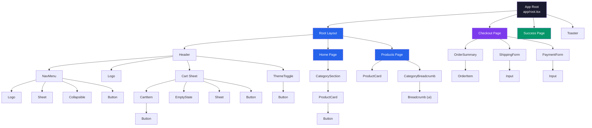
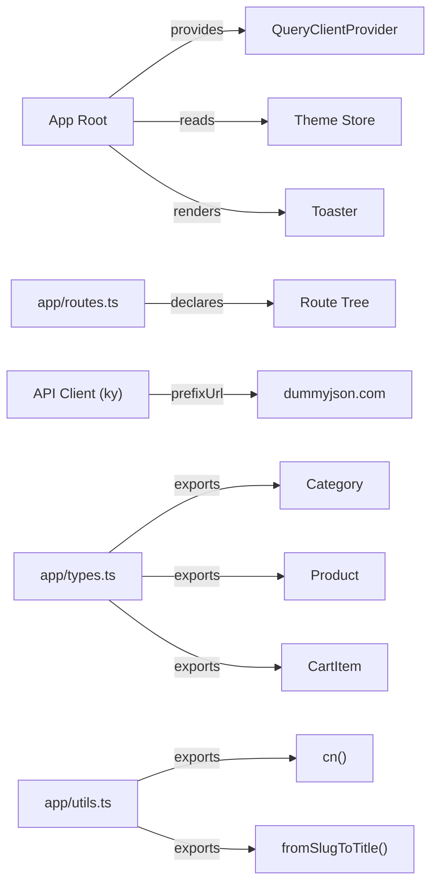
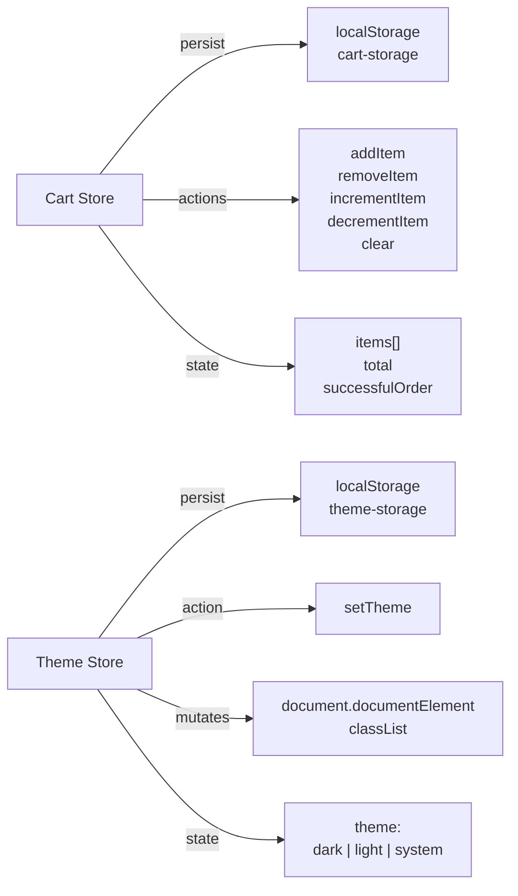
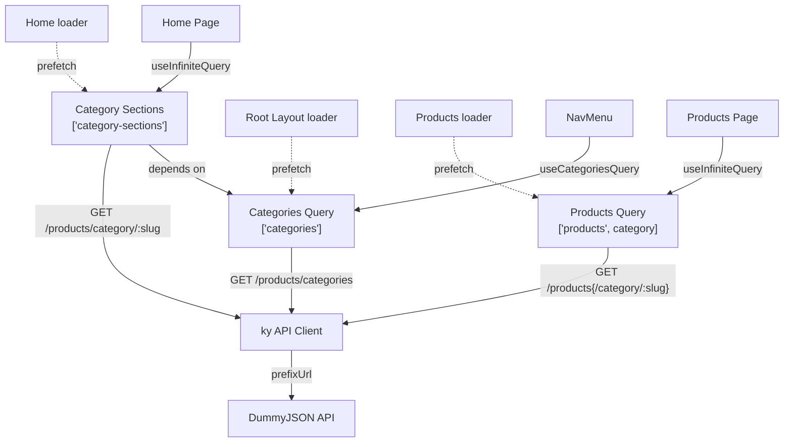
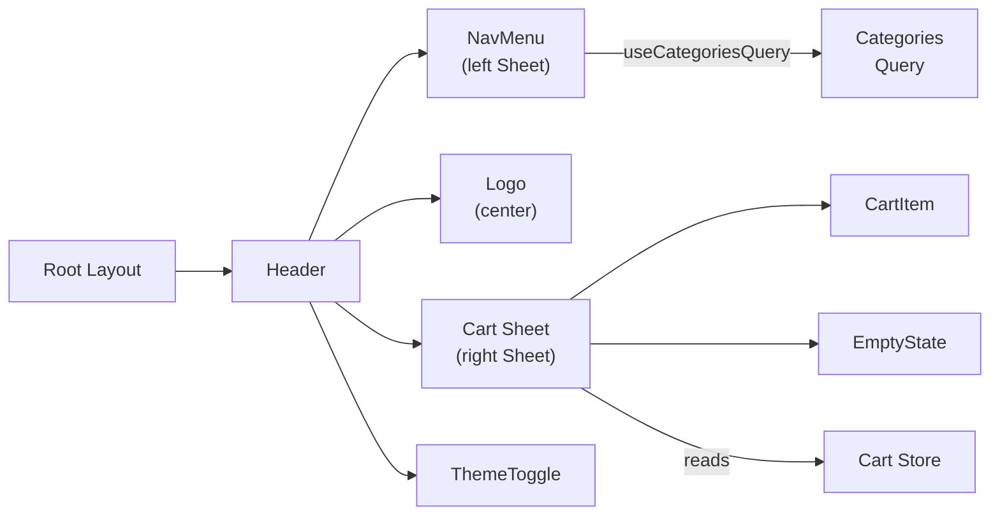
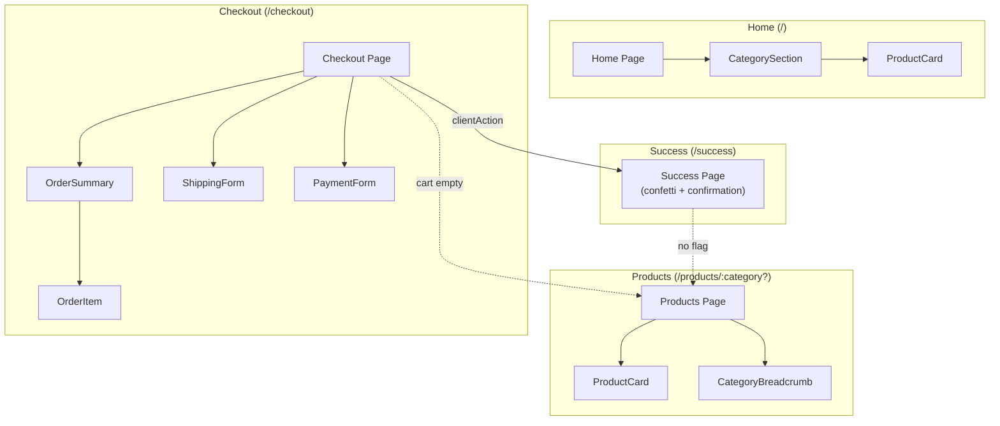
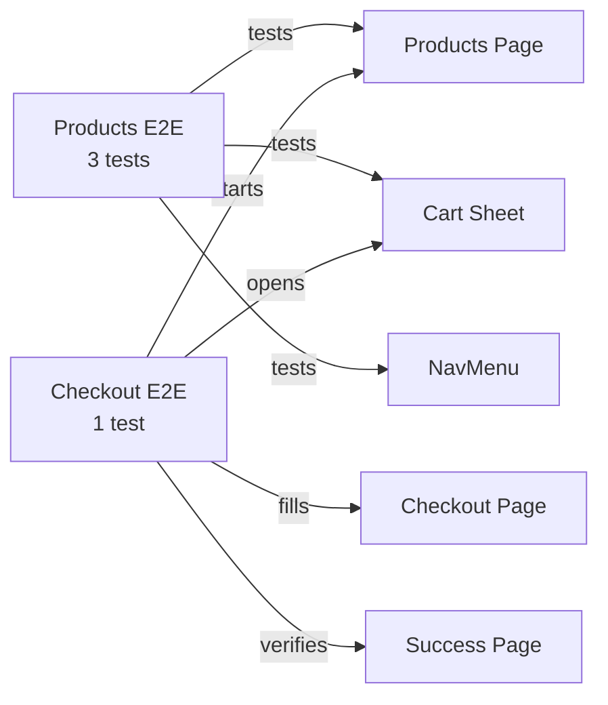

[Open interactive architecture viewer](/sous-storefront/architecture/)

## Component Hierarchy

Every parent-child rendering relationship in the app. App Root is the outermost shell (QueryClientProvider, theme init, Toaster). Root Layout wraps browsing routes with the shared Header. Checkout and Success render directly from the Root Outlet without shared chrome.

## Core

| Component | File | Key Exports |
|---|---|---|
| App (Root Module) | `app/root.tsx` | `Layout`, `App`, `ErrorBoundary` |
| Route Config | `app/routes.ts` | `default (RouteConfig[])` |
| API Client | `app/api.ts` | `api` |
| Type Definitions | `app/types.ts` | `Category`, `Product`, `CartItem` |
| Utility Functions | `app/utils.ts` | `cn`, `fromSlugToTitle` |
| Global Styles | `app/app.css` | TailwindCSS v4 entry point |

## Stores (Zustand)

Cart Store manages items, computed total, and the `successfulOrder` flag (redirect guard for the success page). Theme Store persists theme preference and directly mutates the DOM classList for instant CSS variable switching.

| Store | File | Exports |
|---|---|---|
| Cart Store | `app/hooks/cart-store.tsx` | `useCartStore` |
| Theme Store | `app/hooks/theme-store.tsx` | `useThemeStore` |

## Queries (TanStack Query)

Each query exports a `queryOptions` object (for SSR prefetch in loaders, dashed lines) and a React hook (for client-side consumption, solid lines). Category Sections depends on Categories for pagination bounds.

| Query | File | Key | Pagination |
|---|---|---|---|
| Categories | `app/hooks/categories-query.tsx` | `["categories"]` | None |
| Category Sections | `app/routes/home/hooks/category-sections-infinte-query.tsx` | `["category-sections"]` | Infinite (batches of 4 categories) |
| Products | `app/routes/products/hooks/products-infinite-query.tsx` | `["products", category]` | Infinite (8 per page, skip-based) |

## Root Layout

Root Layout renders the sticky Header, which composes four children: NavMenu (left Sheet drawer, categories from query), Logo (centered), Cart Sheet (right Sheet, reads from Cart Store), and ThemeToggle.

| Component | File | Exports |
|---|---|---|
| Root Layout | `app/routes/root-layout/index.tsx` | `loader`, `RootLayout` |
| Header | `app/routes/root-layout/components/header.tsx` | `default` |
| Logo | `app/routes/root-layout/components/logo.tsx` | `Logo` |
| NavMenu | `app/routes/root-layout/components/nav-menu.tsx` | `NavMenu` |
| Cart Sheet | `app/routes/root-layout/components/cart/index.tsx` | `Cart` |
| CartItem | `app/routes/root-layout/components/cart/cart-item.tsx` | `CartItem` |
| Cart EmptyState | `app/routes/root-layout/components/cart/empty-state.tsx` | `EmptyState` |

## Route Components

**Home** renders CategorySection rows via infinite scroll (intersection observer). Each section is a horizontal scrollable row of ProductCards with a "See More" link.

**Products** renders a responsive ProductCard grid with "Load more" button. CategoryBreadcrumb appears when a category filter is active.

**Checkout** has two-column layout: OrderSummary (OrderItems with subtotal, VAT 20%, total) and ShippingForm + PaymentForm. Client-side loader guards empty cart.

**Success** fires js-confetti on mount, shows order number and "Continue Shopping" link. Client-side loader guards against direct access.

## Shared Components

| Component | File | Exports |
|---|---|---|
| ProductCard | `app/components/product-card.tsx` | `ProductCard`, `ProductCardSkeleton` |
| ThemeToggle | `app/components/theme-toggle.tsx` | `ThemeToggle` |

## UI Primitives (shadcn/ui)

| Primitive | File | Key Exports |
|---|---|---|
| Breadcrumb | `app/components/ui/breadcrumb.tsx` | `Breadcrumb`, `BreadcrumbList`, `BreadcrumbItem`, `BreadcrumbLink` |
| Button | `app/components/ui/button.tsx` | `Button`, `buttonVariants` |
| Collapsible | `app/components/ui/collapsible.tsx` | `Collapsible`, `CollapsibleTrigger`, `CollapsibleContent` |
| Input | `app/components/ui/input.tsx` | `Input` |
| NavigationMenu | `app/components/ui/navigation-menu.tsx` | `NavigationMenu`, `NavigationMenuList`, `NavigationMenuTrigger` |
| Sheet | `app/components/ui/sheet.tsx` | `Sheet`, `SheetTrigger`, `SheetContent`, `SheetHeader` |
| Toaster | `app/components/ui/sonner.tsx` | `Toaster` |

All primitives are built on Radix UI and use `cn()` from utils for Tailwind class merging.

## Tests

| Test Suite | File | Coverage |
|---|---|---|
| Products E2E | `e2e/products.spec.ts` | Product display, add-to-cart, category navigation |
| Checkout E2E | `e2e/checkout.spec.ts` | Full checkout flow from cart to success page |
