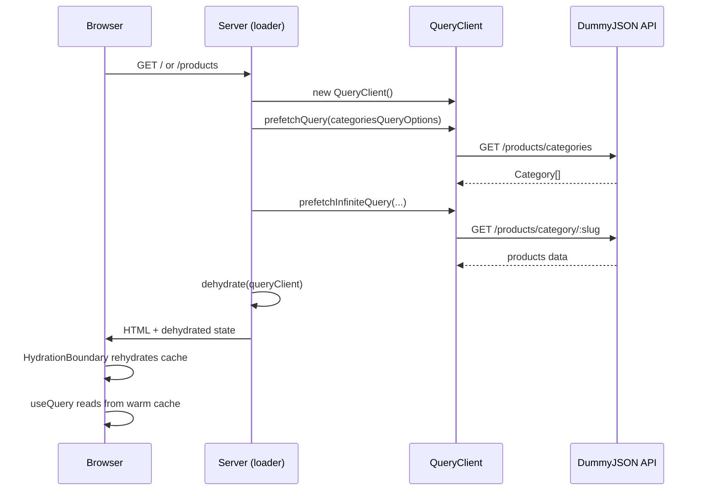
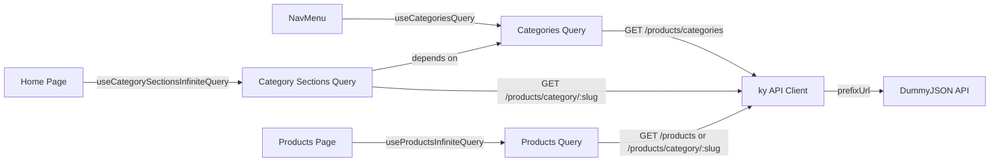
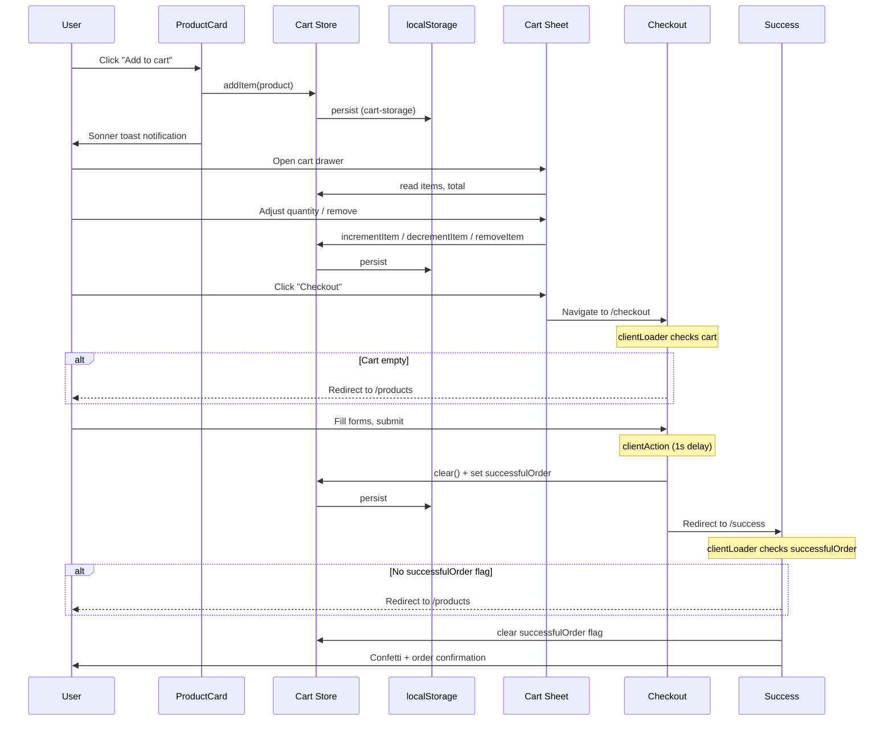
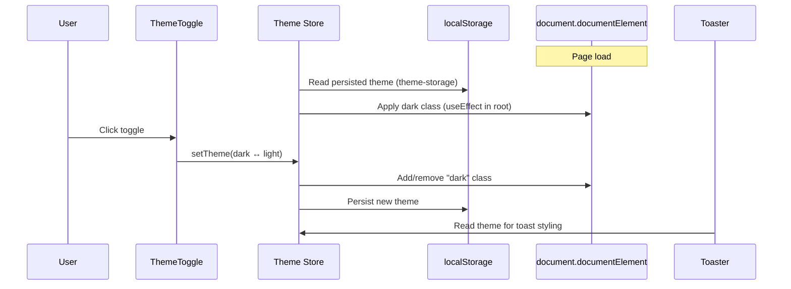
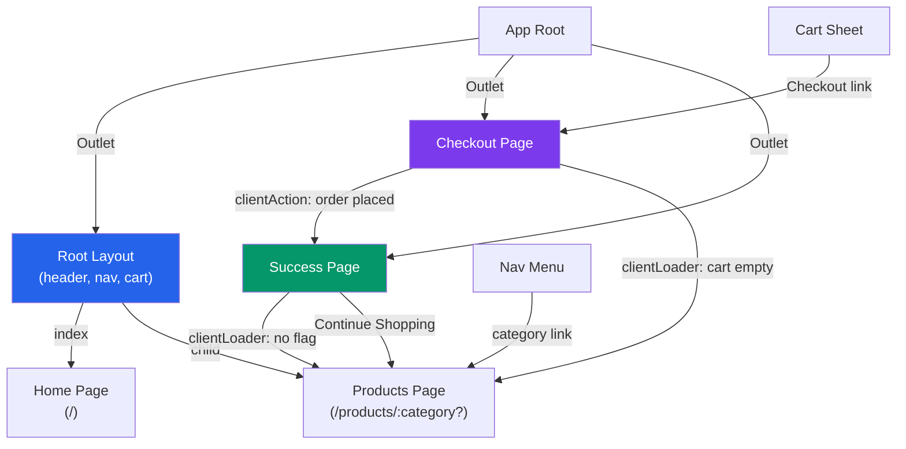

Documentation of the key data flows through the application. Each flow traces data from origin to destination, covering both server and client execution contexts.

## SSR Prefetch and Hydration

Server-side loaders in `root-layout`, `home`, and `products` routes prefetch data before rendering. The dehydrated query cache is serialized into the HTML response, then rehydrated on the client so TanStack Query hooks read from a warm cache without refetching.

**Routes that prefetch:**
- **Root Layout** -- prefetches categories query
- **Home** -- prefetches categories + first page of category sections (4 categories x 4 products)
- **Products** -- prefetches first page of products infinite query

## Client-Side Data Fetching

After hydration, TanStack Query hooks manage ongoing data fetching. Infinite queries support pagination -- the home page uses intersection observer for auto-loading, while the products page uses a manual "Load more" button.

All queries flow through the shared `api` client (ky instance with `prefixUrl: https://dummyjson.com`).

**Query keys and caching:**

| Query | Key | Pagination | Trigger |
|---|---|---|---|
| Categories | `["categories"]` | None | SSR prefetch, nav-menu mount |
| Category Sections | `["category-sections"]` | Infinite (batch of 4 categories) | Intersection observer |
| Products | `["products", category]` | Infinite (8 per page, skip-based) | "Load more" button |

## Cart Flow

The cart lifecycle spans four routes and uses a Zustand store persisted to localStorage as the single source of truth.

**Cart store actions:**

| Action | Behavior |
|---|---|
| `addItem(product)` | Upsert: increment quantity if exists, otherwise add with quantity 1 |
| `removeItem(id)` | Remove item from cart |
| `incrementItem(id)` | Increase quantity by 1 |
| `decrementItem(id)` | Decrease quantity by 1, remove if reaches 0 |
| `clear()` | Empty the cart, reset total |

## Theme Toggle

Theme state is persisted in localStorage and applied via CSS class on `document.documentElement`. The toggle is a binary switch between dark and light modes.

**Theme values:**

| Value | Effect |
|---|---|
| `"dark"` | `dark` class on `<html>`, dark oklch color tokens active |
| `"light"` | No `dark` class, light oklch color tokens active |
| `"system"` | Follows `prefers-color-scheme` media query |

## Navigation

React Router v7 manages all route transitions. The root layout wraps browsing routes (home, products) with a shared header, nav menu, and cart. Checkout and success are standalone routes without the shared chrome.

Client-side loaders on checkout and success act as redirect guards based on cart state.

**Route guards:**

| Route | Guard | Condition | Redirect |
|---|---|---|---|
| `/checkout` | `clientLoader` | Cart has no items | `/products` |
| `/success` | `clientLoader` | `successfulOrder` flag not set | `/products` |
