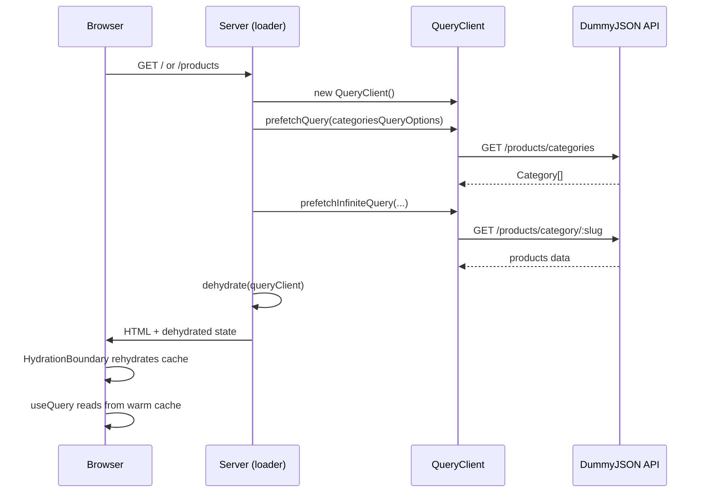
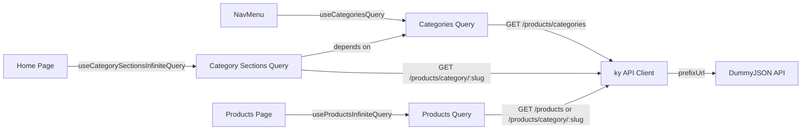
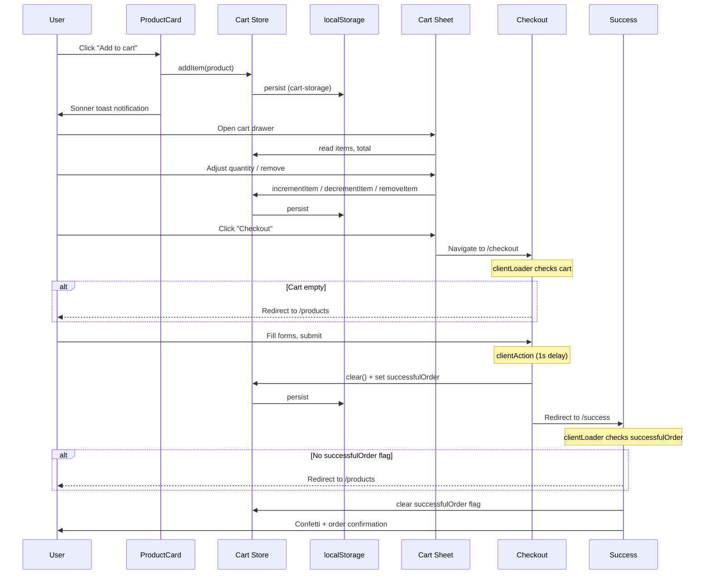
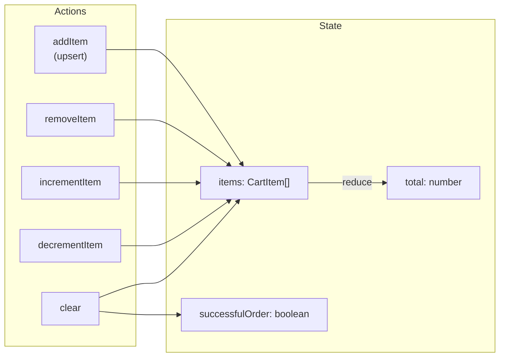
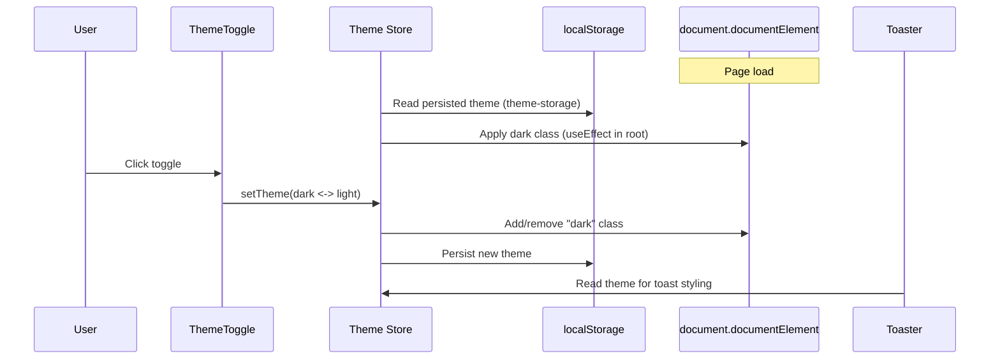
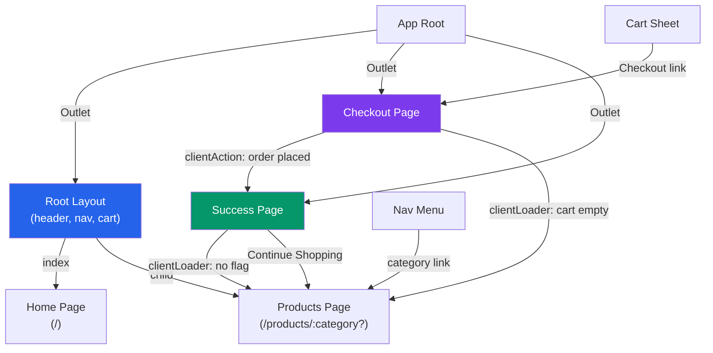

[Open interactive architecture viewer](/sous-storefront/architecture/)

## SSR Prefetch & Hydration

Route loaders in `root-layout`, `home`, and `products` create a QueryClient, prefetch queries against the DummyJSON API, then dehydrate the cache into the HTML response. On the client, `HydrationBoundary` rehydrates the TanStack Query cache so hooks read from warm data without refetching.

**Routes that prefetch:**

| Route | Prefetches | Query Key |
|---|---|---|
| Root Layout | Categories | `["categories"]` |
| Home | Categories + first 4 category sections | `["categories"]`, `["category-sections"]` |
| Products | First page of products | `["products", category]` |

## Client-Side Data Fetching

After hydration, TanStack Query hooks manage ongoing data fetching through the shared `api` client (ky with `prefixUrl: https://dummyjson.com`). Infinite queries support pagination -- home uses intersection observer for auto-loading, products uses a manual "Load more" button.

| Query | Key | Pagination | Trigger |
|---|---|---|---|
| Categories | `["categories"]` | None | SSR prefetch, nav-menu mount |
| Category Sections | `["category-sections"]` | Infinite (batch of 4 categories) | Intersection observer |
| Products | `["products", category]` | Infinite (8 per page, skip-based) | "Load more" button |

## Cart Lifecycle

The cart spans four routes with a Zustand store (persisted to localStorage) as single source of truth. ProductCard fires `addItem`, the Cart Sheet provides quantity controls, Checkout clears the cart on submission, and Success verifies the `successfulOrder` flag before showing confirmation.

## Theme Toggle

Theme state persisted in localStorage via Zustand. On mount, the root component reads the theme imperatively and applies the `dark` class. The toggle switches between dark and light. `setTheme` directly mutates `documentElement.classList` for instant CSS variable switching. The Sonner Toaster reads the theme store for toast styling.

| Value | Effect |
|---|---|
| `"dark"` | `dark` class on `<html>`, dark oklch tokens active |
| `"light"` | No `dark` class, light oklch tokens active |
| `"system"` | Follows `prefers-color-scheme` media query |

## Route Navigation

React Router v7 manages all transitions. Root Layout wraps `/` and `/products` with shared chrome. Checkout and Success are standalone. Client-side loaders act as redirect guards:

| Route | Guard | Condition | Redirect |
|---|---|---|---|
| `/checkout` | `clientLoader` | Cart has no items | `/products` |
| `/success` | `clientLoader` | `successfulOrder` flag not set | `/products` |
