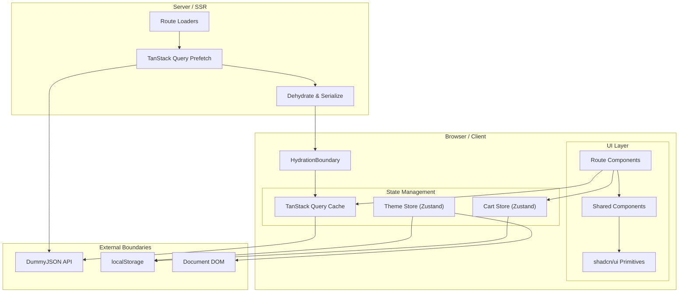
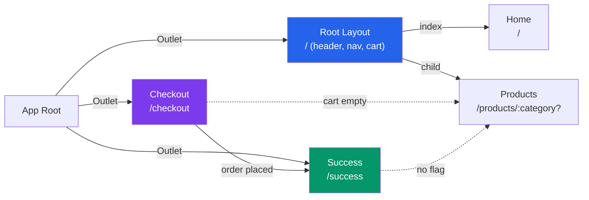
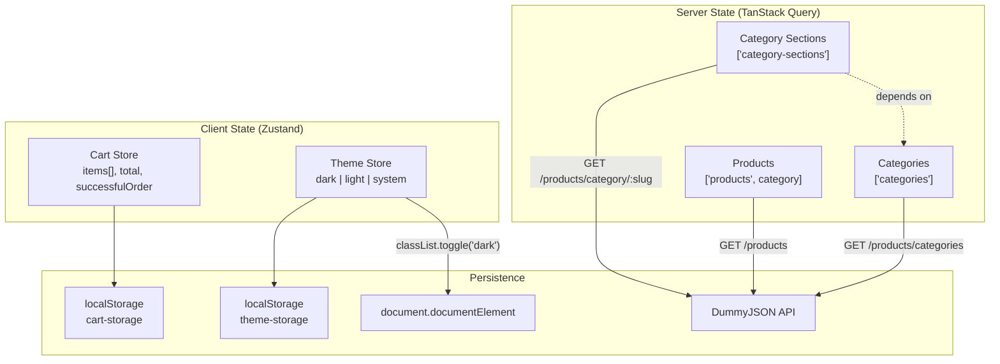

[Open interactive architecture viewer](/sous-storefront/architecture/)

## System Layers

Four layers. **Server** runs route loaders that prefetch data via TanStack Query, dehydrate it, and embed it in the HTML response. **Client state** splits into TanStack Query (server-derived product/category data) and Zustand stores (client-only cart and theme), both persisted to localStorage. The **UI layer** composes route pages from shared components and shadcn/ui primitives. **External boundaries** are the DummyJSON API, localStorage, and the DOM (for theme class toggling).

## Route Map

Root Layout wraps browsing routes (`/` and `/products`) with shared header, nav drawer, and cart drawer. Checkout and Success are standalone (no shared chrome). Dashed lines are client-side redirect guards based on cart state.

## State Architecture

Server state (product data) flows through TanStack Query with SSR prefetch. Client state (cart, theme) lives in Zustand stores persisted to localStorage. The theme store also writes directly to the DOM for instant CSS variable switching.

## Routes

| Path | Route | Prerendered | Layout |
|---|---|---|---|
| `/` | Home | Yes | Root Layout (header, nav, cart) |
| `/products/:category?` | Products | `/products` only | Root Layout |
| `/checkout` | Checkout | No | Standalone (no header) |
| `/success` | Success | No | Standalone (no header) |

## Tech Stack

| Layer | Technology |
|---|---|
| Framework | React Router v7 (SSR + prerendering) |
| Language | TypeScript 5.8 |
| Styling | TailwindCSS v4 |
| UI Library | shadcn/ui (new-york style) on Radix UI primitives |
| Server State | TanStack Query v5 |
| Client State | Zustand v5 (localStorage persistence) |
| HTTP Client | ky |
| Bundler | Vite 6 |
| Testing | Playwright (E2E) |
| CI | GitHub Actions |
| Runtime | Node 20 Alpine (Docker) |
