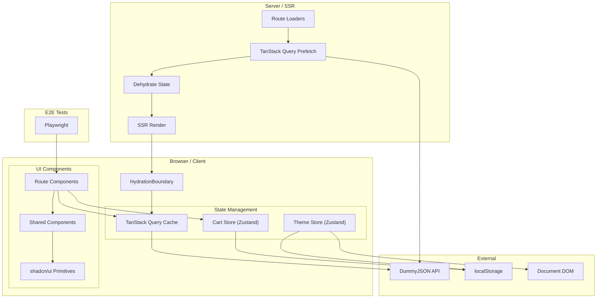

Sous Storefront is a React e-commerce storefront built with modern web technologies. It demonstrates server-side rendering with selective prerendering, client-side state management, and a full shopping cart flow -- from browsing products to checkout and order confirmation.

## Tech Stack

| Layer | Technology |
|---|---|
| Framework | React Router v7 (SSR + prerendering) |
| Language | TypeScript 5.8 |
| Styling | TailwindCSS v4 |
| UI Library | shadcn/ui (new-york style) on Radix UI primitives |
| Server State | TanStack Query v5 |
| Client State | Zustand v5 (localStorage persistence) |
| HTTP Client | ky |
| Bundler | Vite 6 |
| Testing | Playwright (E2E) |
| CI | GitHub Actions |
| Runtime | Node 20 Alpine (Docker) |

## Architecture Summary

The application follows a layered architecture with clear separation between server-side rendering, client-side state, data fetching, and UI composition.

**Server layer** handles SSR and prerendering. Route loaders prefetch data via TanStack Query on the server, dehydrate the query cache, and pass it to the client through `HydrationBoundary`. The `/` and `/products` routes are prerendered at build time.

**Client layer** manages two concerns: server state (product data from the DummyJSON API via TanStack Query) and client state (cart and theme via Zustand stores persisted to localStorage).

**UI layer** is built on shadcn/ui components (Button, Sheet, Collapsible, Breadcrumb, Input, NavigationMenu) with Radix UI primitives underneath. Route-specific components compose these primitives into pages.

**External dependencies** are minimal: the DummyJSON public API for product data, and browser localStorage for persistence.

## Routes

| Path | Route | Prerendered | Layout |
|---|---|---|---|
| `/` | Home | Yes | Root Layout (header, nav, cart) |
| `/products/:category?` | Products | `/products` only | Root Layout |
| `/checkout` | Checkout | No | Standalone (no header) |
| `/success` | Success | No | Standalone (no header) |

## Deployment

The application is containerized via a multi-stage Docker build on `node:20-alpine`:

1. Install dev dependencies
2. Install production dependencies
3. Build with Vite / React Router
4. Serve with `react-router-serve`
